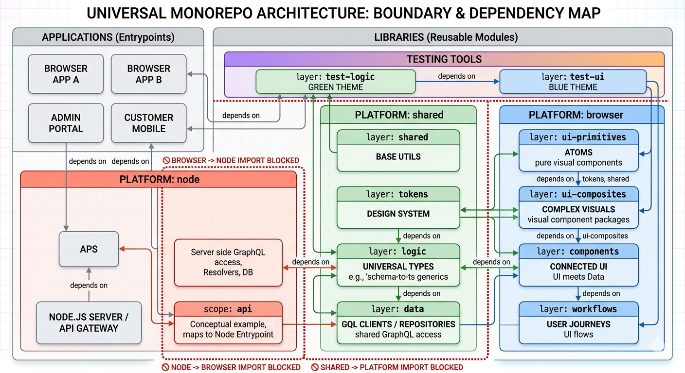
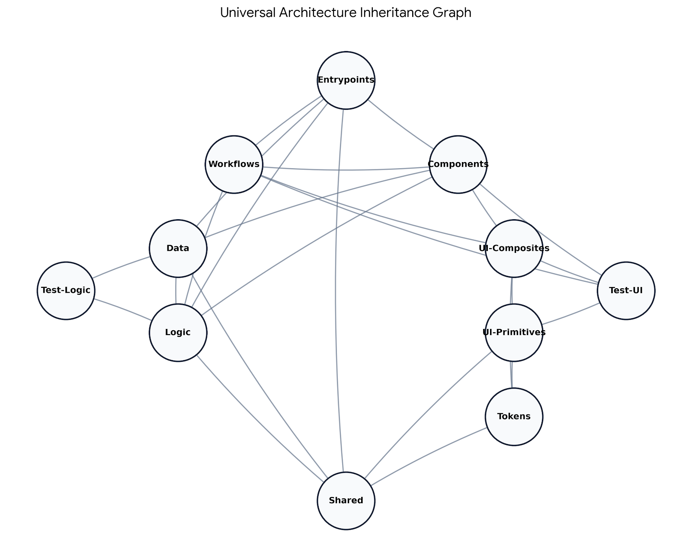

# 🏗️ Universal Monorepo Architecture

This repository uses a **Linear Design System Pipeline** and **Universal Business Logic** strategy.

---

## 🗺️ Architectural Hierarchy

Dependencies flow **strictly downward**. Higher layers orchestrate; lower layers provide primitives.

---

## 층 (Layers) Definition & Tags

| Layer             | Tag                   | Description                           | Allowed Dependencies                                 |
| :---------------- | :-------------------- | :------------------------------------ | :--------------------------------------------------- |
| **Entrypoints**   | `layer:entrypoints`   | Apps or Servers. The final "runners". | `workflows`, `components`, `data`, `logic`, `shared` |
| **Workflows**     | `layer:workflows`     | Stateful user journeys & sub-routing. | `components`, `ui-composites`, `logic`, `test-ui`    |
| **Components**    | `layer:components`    | **The Merge Point.** UI + Data.       | `ui-composites`, `data`, `logic`, `test-ui`          |
| **UI-Composites** | `layer:ui-composites` | Purely visual complex units (Cards).  | `ui-primitives`, `tokens`, `test-ui`                 |
| **UI-Primitives** | `layer:ui-primitives` | Atomic visual units (Buttons).        | `tokens`, `shared`, `test-ui`                        |
| **Data**          | `layer:data`          | GQL Clients, Hooks, Repositories.     | `logic`, `shared`, `test-logic`                      |
| **Logic**         | `layer:logic`         | Universal Schema Types & TS Generics. | `shared`, `test-logic`                               |
| **Tokens**        | `layer:tokens`        | Design Tokens, Themes, Styling.       | `shared`                                             |
| **Shared**        | `layer:shared`        | Base Utilities & Core Constants.      | None (Foundation)                                    |

---

## 💡 Quick Reference (Cheat Sheet)

### 🚀 Creating a New App (Browser)

- **Entrypoint:** `apps/my-new-app` (`layer:entrypoints`).
- **Dependency:** Should depend on a `Workflow` (the main route) and `Tokens` (the theme).
- **Responsibility:** Provide the `<ThemeProvider />` and `<ApolloProvider />`.

### 🖥️ Creating a Server Component (Node)

- **Entrypoint:** `apps/api-gateway` (`layer:entrypoints`).
- **Dependency:** Depends on `layer:logic` (Schema Types) and `layer:data` (Resolvers/DB).
- **Safety:** If you accidentally import a `Button`, Nx will block the build.

### 🎨 Building a "Pure Visual" Library

- **Scenario:** I have a new "Card" design for a client project.
- **Tag:** `layer:ui-composites`.
- **Constraint:** It can see `ui-primitives` (Buttons) but **cannot** see GraphQL hooks. Use props for data!

### 🔗 Merging Data into UI

- **Scenario:** I need a `UserHeader` that fetches a profile picture via GraphQL.
- **Tag:** `layer:components`.
- **Merge:** Imports `ui-composites` (the layout) and `data` (the hook). This is the _only_ place they meet.

### 🧪 Adding Testing Tools

- **Logic/Math Testing:** Put in `layer:test-logic`. Node-safe.
- **UI/Harness Testing:** Put in `layer:test-ui`. Can see `ui-primitives` to provide helpers like `clickButton()`.

---

## 🛠️ Platform Isolation

- `platform:browser`: Code with `window`, `document`, or DOM-specific CSS.
- `platform:node`: Code with `fs`, `path`, or server-side resolvers.
- `platform:shared`: Pure TS (Shared by both).

**Rule:** `platform:node` libraries can **never** import `platform:browser` libraries.
