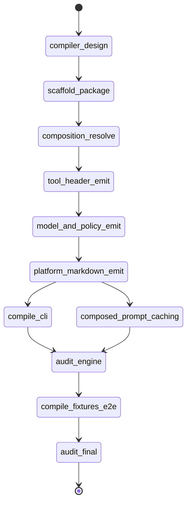

# State machine — agent-compiler



| State | Phase | Kind | Guard |
|---|---|---|---|
| compiler-design | architecture | work | `python3 .../audit_compiler.py --phase architecture` |
| scaffold-package | foundation | work | `npx --yes nx build agent-compiler` |
| composition-resolve | resolve | work | `npx --yes nx test agent-compiler --testFile=.../composition-resolve.test.ts` |
| tool-header-emit | resolve | work | `npx --yes nx test agent-compiler --testFile=.../tool-header.test.ts` |
| model-and-policy-emit | resolve | work | `npx --yes nx test agent-compiler --testFile=.../model-policy.test.ts` |
| platform-markdown-emit | emit | work | `npx --yes nx test agent-compiler --testFile=.../compile-agent.test.ts` |
| compile-cli | cli | work | `npx --yes nx test agent-compiler --testFile=.../compile-cli.test.ts` |
| composed-prompt-caching | cache | work | `npx --yes nx test agent-compiler --testFile=.../compile-cache.test.ts` |
| audit-engine | audit | audit | `python3 .../audit_compiler.py --phase schema` |
| compile-fixtures-e2e | e2e | work | `npx --yes nx test agent-compiler --testFile=.../compile-e2e.test.ts` |
| audit-final | audit | audit | `python3 .../audit_compiler.py --phase final` |

`compile-cli` and `composed-prompt-caching` both fan out from
`platform-markdown-emit` and both feed `audit-engine`; they mutate disjoint files
(`cli/compile.ts` vs. `cache/composed-prompt-cache.ts`) and serialize through the
shared `compile.ts` / `index.ts` barrel.

## DoD → proving check map

| DoD | Kind | Proven by | Entrypoint token |
|---|---|---|---|
| dod.1 | behavioral (HEADLINE) | `dod.1` check | `compile-e2e.test.ts` — frontmatter `tools:` (from `tool_platform_bindings`) + body in junction order, from real rows |
| dod.2 | behavioral | `dod.2` check | `compile-e2e.test.ts` — context `{ticket_type:security}` selects the security `success_criteria` |
| dod.3 | behavioral | `dod.3` check | `compile-e2e.test.ts` — attached `no-credentials` policy constraint present |
| dod.4 | behavioral | `dod.4` check | `compile-cache.test.ts` — recompile hits cached `composed_prompts` row after DB reopen |
| dod.5 | behavioral | `dod.5` check | `compile-cli.test.ts` — real CLI bin prints YAML-frontmatter markdown to stdout |
| dod.6 | structural | `dod.6` grep | `platform:node` + `@adhd/agent-compiler` path + four registry deps |
| dod.7 | structural | `dod.7` grep | writes `composed_prompts` + emits `yaml_frontmatter` and `json_object` |
```
