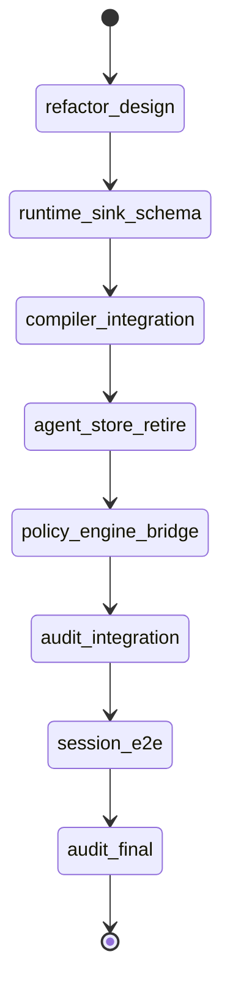

# State machine — agent-mcp-refactor

| State | Phase | Kind | Guard |
|---|---|---|---|
| refactor-design | architecture | work | `python3 .../audit_mcp_refactor.py --phase architecture` |
| runtime-sink-schema | schema | work | `npx --yes nx test agent-mcp --testFile=.../composed-prompt-schema.test.ts` |
| compiler-integration | integration | work | `npx --yes nx test agent-mcp --testFile=.../compiler-resolve.test.ts` |
| agent-store-retire | retire | work | `npx --yes nx test agent-mcp --testFile=.../agent-cache-store.test.ts` |
| policy-engine-bridge | integration | work | `npx --yes nx test agent-mcp --testFile=.../policy-tool-reconcile.test.ts` |
| audit-integration | audit | audit | `python3 .../audit_mcp_refactor.py --phase integration` |
| session-e2e | e2e | work | `npx --yes nx test agent-mcp --testFile=.../session-compiler-e2e.test.ts` |
| audit-final | audit | audit | `python3 .../audit_mcp_refactor.py --phase final` |

## DoD → state map

| DoD | Kind | Delivered by | Proven by |
|---|---|---|---|
| dod.1 session systemPrompt from compiler | behavioral | refactor-design, runtime-sink-schema, compiler-integration, session-e2e | `session-compiler-e2e.test.ts` |
| dod.2 second session cache reuse | behavioral | refactor-design, runtime-sink-schema, compiler-integration, session-e2e | `cache-reuse.test.ts` (reopen) |
| dod.3 full suite non-regression | behavioral | compiler-integration, agent-store-retire, policy-engine-bridge, session-e2e | `npx --yes nx test agent-mcp` |
| dod.4 flat-systemPrompt authoring path gone | structural | refactor-design, agent-store-retire | grep_absent `systemPrompt: z.string()` |
| dod.5 runtime sink schema + compiler dep | structural | refactor-design, runtime-sink-schema, compiler-integration | grep `composed_prompt_id` + `@adhd/agent-compiler` |
| dod.6 claudecli tool model reconciled | structural | refactor-design, policy-engine-bridge | grep claudecli AGENT_TOOL/compiled-tools |

## Cross-plan dependency

Depends on plan 5 `agent-compiler` (`compileAgent`), recorded in `dag.json`
`depends_on_plans` and treated as `assumed_baseline` (`[inv:compiler-is-baseline]`).
