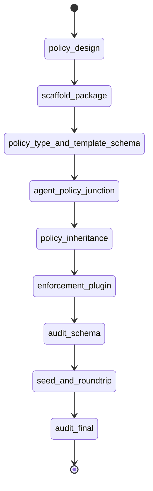

# State machine — agent-policy

| State | Phase | Kind | Guard |
|---|---|---|---|
| policy-design | architecture | work | `python3 .../audit_policy.py --phase architecture` |
| scaffold-package | foundation | work | `npx --yes nx build agent-policy` |
| policy-type-and-template-schema | schema | work | `npx --yes nx test agent-policy --testFile=.../policy-template-store.test.ts` |
| agent-policy-junction | schema | work | `npx --yes nx test agent-policy --testFile=.../agent-policy-store.test.ts` |
| policy-inheritance | schema | work | `npx --yes nx test agent-policy --testFile=.../inheritance.test.ts` |
| enforcement-plugin | enforcement | work | `npx --yes nx test agent-policy --testFile=.../enforcement-plugin.test.ts` |
| audit-schema | audit | audit | `python3 .../audit_policy.py --phase schema` |
| seed-and-roundtrip | seed | work | `npx --yes nx test agent-policy --testFile=.../roundtrip.test.ts` |
| audit-final | audit | audit | `python3 .../audit_policy.py --phase final` |

## DoD → proving check map

| DoD | Kind | Proven by | Entrypoint token |
|---|---|---|---|
| dod.1 | behavioral | `dod.1` check | `inheritance.test.ts` |
| dod.2 | behavioral | `dod.2` check | `enforcement-plugin.test.ts` (real `HookRegistry.enforce`) |
| dod.3 | behavioral | `dod.3` check | `roundtrip.test.ts` |
| dod.4 | structural | `dod.4` grep | `platform:node` + `@adhd/agent-policy` path |
| dod.5 | structural | `dod.5` grep | tables + lookup-not-enum + `configSchema`/`createPlugin` |
