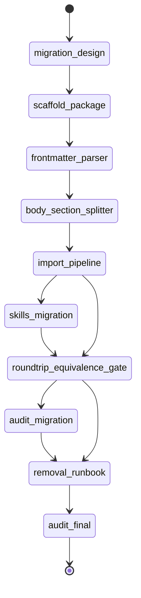

# State machine — agent-registry-migration

`audit-migration` is the zero-data-loss firewall: `removal-runbook` depends on it,
so the removal phase cannot start until the migration tool (parse → import →
round-trip equivalence, with teeth) is proven correct.

| State | Phase | Kind | Guard |
|---|---|---|---|
| migration-design | architecture | work | `python3 .../audit_migration.py --phase architecture` |
| scaffold-package | foundation | work | `npx --yes nx build agent-registry-migration` |
| frontmatter-parser | parse | work | `npx --yes nx test agent-registry-migration --testFile=.../frontmatter.test.ts` |
| body-section-splitter | parse | work | `npx --yes nx test agent-registry-migration --testFile=.../body-sections.test.ts` |
| import-pipeline | import | work | `npx --yes nx test agent-registry-migration --testFile=.../import-pipeline.test.ts` |
| skills-migration | import | work | `npx --yes nx test agent-registry-migration --testFile=.../skills-migration.test.ts` |
| roundtrip-equivalence-gate | verify | work | `npx --yes nx test agent-registry-migration --testFile=.../roundtrip-equivalence.test.ts` |
| audit-migration | audit | audit | `python3 .../audit_migration.py --phase migration` |
| removal-runbook | removal | work | `npx --yes nx test agent-registry-migration --testFile=.../removal-runbook.test.ts` |
| audit-final | audit | audit | `python3 .../audit_migration.py --phase final` |

## Cross-plan dependency

Plan 7 of 7 — the FINAL plan of the Agent Registry initiative. Depends on
`@adhd/agent-registry` (plan 1, published), `@adhd/agent-compiler` (plan 5), and
the refactored `@adhd/agent-mcp` (plan 6). Nothing depends on this plan. The
`agent-compiler` `compile <slug> --platform claude_code` entrypoint is the real
component the round-trip gate drives.

## DoD → proving check map

| DoD | Kind | Entrypoint (behavioral) / proof (structural) |
|---|---|---|
| dod.1 | behavioral | `roundtrip-equivalence.test.ts` — migrated fixture compiles to equivalent markdown (THE headline); teeth = `[roundtrip-equivalence-gate.4]` |
| dod.2 | behavioral | `import-pipeline.test.ts` — agent+components+tools recoverable after reopen |
| dod.3 | behavioral | `skills-migration.test.ts` — skill → process/invocation component after reopen |
| dod.4 | behavioral | `removal-runbook.test.ts` — removal gated on all-PASS report (refuses on FAIL) |
| dod.5 | structural | `[scaffold-package.1..5]` — platform:node lib + deps registry+compiler + builds |
| dod.6 | structural | `removal-runbook.test.ts` asserts fixture gone AND compile still produces the agent |
