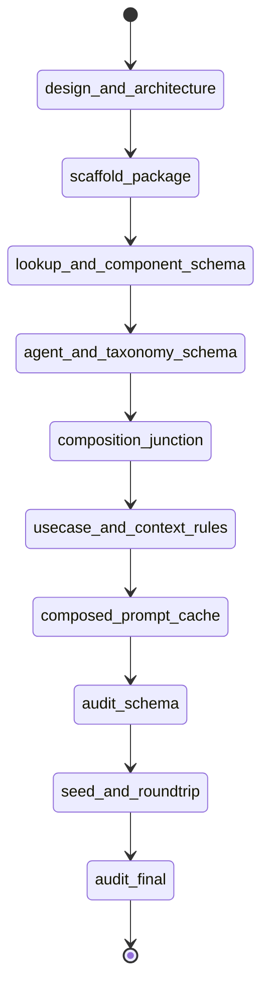

# State machine — agent-registry-schema

| State | Phase | Kind | Guard |
|---|---|---|---|
| design-and-architecture | architecture | work | `python3 .../audit_registry_schema.py --phase architecture` |
| scaffold-package | foundation | work | `npx --yes nx build agent-registry` |
| lookup-and-component-schema | schema | work | `npx --yes nx test agent-registry --testFile=.../component-store.test.ts` |
| agent-and-taxonomy-schema | schema | work | `npx --yes nx test agent-registry --testFile=.../agent-store.test.ts` |
| composition-junction | composition | work | `npx --yes nx test agent-registry --testFile=.../composition-store.test.ts` |
| usecase-and-context-rules | composition | work | `npx --yes nx test agent-registry --testFile=.../usecase-store.test.ts` |
| composed-prompt-cache | composition | work | `npx --yes nx test agent-registry --testFile=.../composed-prompt-store.test.ts` |
| audit-schema | audit | audit | `python3 .../audit_registry_schema.py --phase schema` |
| seed-and-roundtrip | seed | work | `npx --yes nx test agent-registry --testFile=.../roundtrip.test.ts` |
| audit-final | audit | audit | `python3 .../audit_registry_schema.py --phase final` |
