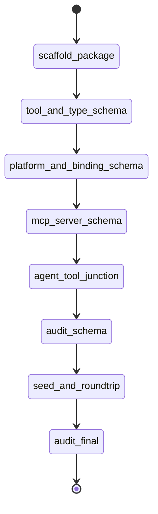

# State machine — agent-tool-registry

| State | Phase | Kind | Guard |
|---|---|---|---|
| scaffold-package | foundation | work | `npx --yes nx build agent-tool-registry` |
| tool-and-type-schema | schema | work | `npx --yes nx test agent-tool-registry --testFile=.../tool-store.test.ts` |
| platform-and-binding-schema | schema | work | `npx --yes nx test agent-tool-registry --testFile=.../binding-store.test.ts` |
| mcp-server-schema | schema | work | `npx --yes nx test agent-tool-registry --testFile=.../mcp-server-store.test.ts` |
| agent-tool-junction | schema | work | `npx --yes nx test agent-tool-registry --testFile=.../agent-tool-store.test.ts` |
| audit-schema | audit | audit | `python3 .../audit_tool_registry.py --phase schema` |
| seed-and-roundtrip | seed | work | `npx --yes nx test agent-tool-registry --testFile=.../roundtrip.test.ts` |
| audit-final | audit | audit | `python3 .../audit_tool_registry.py --phase final` |

## Cross-plan dependency

This is plan **2 of 7**. It depends on `agent-registry-schema` (plan 1) as a
sibling DB domain: all registry packages share one SQLite file with table-name
prefixes (`tool_*`), with no cross-package SQLite FKs. `agent_tools.agent_slug`
is a logical key into `agent-registry`'s `agents` table, resolved at compile time
by `@adhd/agent-compiler`. This package builds and tests standalone.
