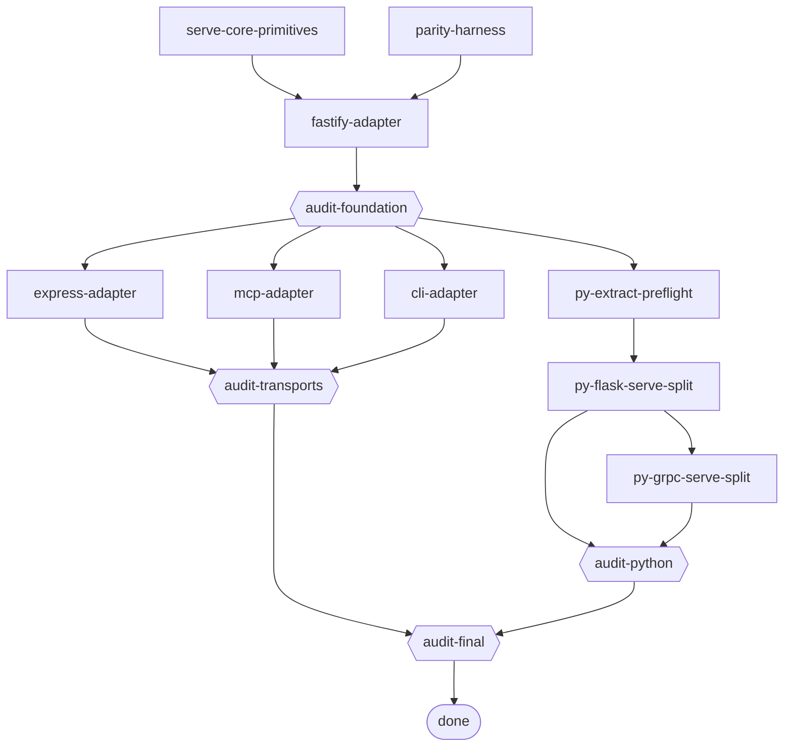

# State machine — apigen transport-neutral serve-core + thin adapters

Human render of `dag.json`. Edit `dag.json`; keep this in sync.

## States

| Slug | Phase | Kind | Depends on |
|---|---|---|---|
| serve-core-primitives | phase-1 | work | — |
| parity-harness | phase-1 | work | — |
| fastify-adapter | phase-1 | work | serve-core-primitives, parity-harness |
| audit-foundation | phase-1 | audit | fastify-adapter |
| express-adapter | phase-2 | work | audit-foundation |
| mcp-adapter | phase-2 | work | audit-foundation |
| cli-adapter | phase-2 | work | audit-foundation |
| audit-transports | phase-2 | audit | express-adapter, mcp-adapter, cli-adapter |
| py-extract-preflight | phase-3 | work (spike) | audit-foundation |
| py-flask-serve-split | phase-3 | work | py-extract-preflight |
| py-grpc-serve-split | phase-3 | work | py-flask-serve-split |
| audit-python | phase-3 | audit | py-flask-serve-split, py-grpc-serve-split |
| audit-final | final | audit | audit-transports, audit-python |

## Waves

- **Wave 1:** serve-core-primitives ∥ parity-harness (write-disjoint).
- **Wave 2:** fastify-adapter → audit-foundation.
- **Wave 3 (parallel):** express-adapter ∥ mcp-adapter ∥ cli-adapter ∥ py-extract-preflight
  (each rewrites a different plugin dir / writes a different findings doc; all read the
  Phase-1 runtime read-only — no shared mutable file, no merge protocol needed).
- **Wave 4:** {express,mcp,cli} → audit-transports; py-flask-serve-split → py-grpc-serve-split → audit-python.
- **Wave 5:** audit-final → done.

Critical path (8 hops): serve-core-primitives → fastify-adapter → audit-foundation →
py-extract-preflight → py-flask-serve-split → py-grpc-serve-split → audit-python → audit-final.

## Rollback

Each phase is independently shippable and parity-gated. A transport whose parity gate is
not green (or whose negative control does not go RED) does not merge; its state stays
`blocked`/`failed` and the others proceed. No on-wire contract change ships un-flagged
(see `[inv:byte-identical]`).
