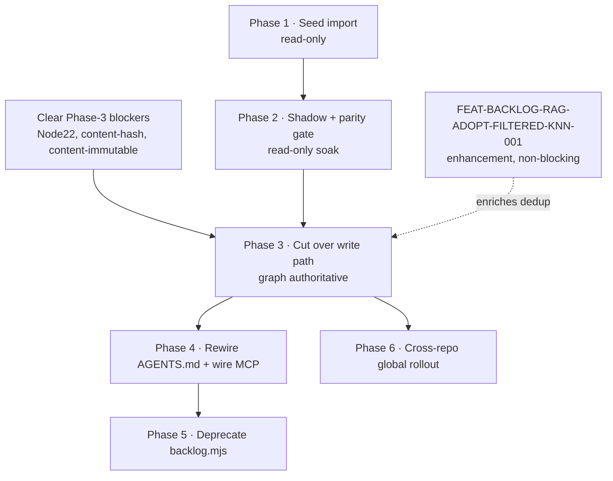

# Backlog Tool Adoption & Migration Plan

**Slug:** `backlog-adoption` · **Status:** DRAFT (not yet executed) · **Authored:** 2026-07-23
**Owner:** _unassigned_ · **Target tool:** `@adhd/backlog@0.0.1` (published)

Migrate this repo — and eventually every repo on the machine — from hand-edited
markdown `BACKLOG.md` files to the graph-backed, multi-agent, cross-repo
`@adhd/backlog` tool as the **source of truth**, with `BACKLOG.md` demoted to a
generated, git-visible *projection* of the graph.

This is a migration **plan**, not an executed migration. Nothing here has run.
The tool is built, published, and its markdown interop is round-trip-proven; it
is **not adopted** — the disclosure rules in `AGENTS.md` still mandate editing
`BACKLOG.md` by hand.

---

## 0. Why migrate at all

The markdown backlog has three structural limits the tool removes:

1. **Concurrent-edit hazard.** `BACKLOG.md` is one file on a shared git index;
   the whole `feedback_commit_pathspec_not_add` / "swept-in files" class of bug
   exists *because* many agents edit one markdown file. A graph store with
   atomic per-item mutation + CAS claims removes the file-level contention
   entirely.[1]
2. **No cross-repo view.** A markdown file is per-repo. `@adhd/backlog` defaults
   to **`global` scope** — one shared graph spanning every repo on the machine
   (`entrypoint/backlog/src/env.ts:46-53` defaults scope to `global`, deliberately
   *not* the generic project-marker default).[2]
3. **No structured query / dedup / RAG.** "Dedupe before filing" (a standing
   `AGENTS.md` mandate) is eyeballed today. The tool gives FTS + symbol dedup now,
   and — once `FEAT-BACKLOG-RAG-ADOPT-FILTERED-KNN-001` lands — *semantic* dedup.

**Non-goals of this migration:** implementing the RAG layer (tracked separately,
now unblocked); changing the *content* of any backlog item; changing the ID
vocabulary or the `Citations:` disclosure standard (those carry over verbatim).

---

## 1. Current architecture (what exists today)

| Piece | State | Evidence |
|---|---|---|
| `@adhd/backlog` client (34 ops) | published `0.0.1` | `entrypoint/backlog/src/client.ts` |
| HTTP + MCP transports (apigen live mount) | working | `entrypoint/backlog/src/server.ts` |
| **CLI transport** | **in flight this session** | `entrypoint/backlog/src/cli.ts` (being added) |
| `importFromMarkdown(ctx, input)` | implemented | `client.ts:234`[3] |
| `renderToMarkdown(ctx, filter?)` | implemented | `client.ts:277`[3] |
| `archiveResolved(ctx, scope, opts?)` | implemented | `client.ts:184`[3] |
| Round-trip parity vs legacy parser | **proven green** | `src/markdown.spec.ts` re-parses a `renderToMarkdown` output with the real `tools/util/backlog.mjs` subprocess and asserts every id/status/priority survives[4] |
| Graph store (SQLite, global scope) | working | `store/graph-backlog-store.ts`, sox-graph-store `^0.3.0` |
| Legacy parser CLI | still in use | `tools/util/backlog.mjs` (17.9 KB)[5] |

The migration's **enabling mechanism already exists and is tested**: the graph
and `BACKLOG.md` are inter-convertible without loss. What is missing is the
*process* cut-over, not the plumbing.

---

## 2. Prerequisites / blockers (must clear before the write-path cut-over)

These gate **Phase 3+** (making the tool authoritative). Phases 1–2 (import +
shadow) can proceed today because they are read-only against the markdown.

| Blocker | ID | Gates | Why |
|---|---|---|---|
| Tool requires Node ≥22; CI pinned to Node 20 | `DEBT-BACKLOG-CI-NODE22-001` (`BACKLOG.md:1094`)[6] | Phase 3 | Agents/CI can't run the tool until the runtime matches |
| Global content-hash dedupe silently collides unrelated items with identical normalized title+body | `DEBT-BACKLOG-CONTENT-HASH-COLLISION-001` (`:1131`)[6] | Phase 3 | An authoritative store must not merge two real distinct bugs |
| `updateItem` can't refresh FTS `content` after a title/body edit | `DEBT-BACKLOG-CONTENT-IMMUTABLE-001` (`:1138`)[6] | Phase 3 | Editing an item is a core write-path op |
| `auditTrail` derives history from durable fields, not a full event log | `DEBT-BACKLOG-AUDIT-TRAIL-PARTIAL-001` (`:1145`)[6] | Phase 4 (nice-to-have for provenance) | Weakens the "who changed what" story vs git blame on markdown |
| Where the **global** DB lives + multi-agent write coordination across repos | _no item yet — see §7 Open decisions_ | Phase 3 (global), Phase 6 | A shared cross-repo DB needs an agreed, backed-up location |
| Semantic dedup (RAG) unimplemented | `FEAT-BACKLOG-RAG-ADOPT-FILTERED-KNN-001` | **NOT a blocker** | FTS/symbol dedup is sufficient for cut-over; RAG is an enhancement |

**Rule:** do not begin Phase 3 until every Phase-3-gating row above is RESOLVED
in `BACKLOG.md`/`CHANGELOG.md`. This plan does not hand-wave them.

---

## 3. Phases

Each phase has a **goal**, **steps**, a **Definition of Done with teeth** (a
concrete observable that fails if the phase regressed — per `AGENTS.md` §7), and
a **rollback**.

### Phase 1 — Seed (idempotent import, read-only)

**Goal:** load every existing markdown backlog into the global graph without
touching any `BACKLOG.md`.

**Steps:**
1. Enumerate every source: root `BACKLOG.md`, `docs/plan/*/BACKLOG.md`,
   `packages/**/BACKLOG.md`, `entrypoint/**/BACKLOG.md`.
2. For each, `importFromMarkdown(ctx, { markdown, sourcePath })` into the
   `global`-scope store. Import must be **idempotent** — re-running maps the same
   item id to the same node (upsert by stable ID), never a duplicate.
3. Record the source path on each node (provenance for the reverse render).

**DoD (teeth):** after import, `exportJson(ctx)` count == the union of unique IDs
across all source markdown files (parsed by the legacy `tools/util/backlog.mjs`
as the independent oracle); **re-running the import a second time changes the
node count by 0** (idempotency proof). A negative control — deliberately
corrupting one item's ID mid-file — must surface as an import diagnostic, not a
silent drop.

**Rollback:** delete the seeded graph DB file. Zero markdown touched, so rollback
is `rm <db>`.

### Phase 2 — Shadow / dual-run + parity gate

**Goal:** prove the graph can regenerate byte-equivalent markdown, continuously,
while humans/agents still edit `BACKLOG.md` by hand.

**Steps:**
1. Add a **read-only** check (nx target or CI job): `renderToMarkdown(ctx)` →
   diff against the live `BACKLOG.md`. The diff is expected to be *semantically*
   empty (same items/status/priority), tolerating only formatting the render
   normalizes.
2. Run it in CI as a **non-blocking** report for a soak period (≥1–2 weeks of
   real edits) to surface every case where the render and the hand-edited file
   disagree, and fix the renderer/importer until they converge.
3. Keep `BACKLOG.md` authoritative throughout.

**DoD (teeth):** for N consecutive CI runs over real edits, the
`renderToMarkdown` output re-parsed by `tools/util/backlog.mjs` yields the
**identical** `{id → (status, priority)}` map as parsing the hand-edited
`BACKLOG.md` — extending the existing `markdown.spec.ts` round-trip proof[4] from
a fixture to the *live evolving* file. A single unreconciled divergence fails the
gate.

**Rollback:** the check is read-only; disable the CI job. Nothing to revert.

### Phase 3 — Cut over the write path

**Goal:** the graph becomes the source of truth; `BACKLOG.md` becomes a generated
artifact.

**Preconditions:** every Phase-3-gating blocker in §2 RESOLVED.

**Steps:**
1. Agents/humans write via the tool surface — the **CLI** (`backlog create-item …`,
   `backlog transition-status …`), the **MCP** tools (`mcp__backlog__*`), or the
   HTTP API — never by hand-editing markdown.
2. A commit hook (or an explicit `nx run backlog:render` target) regenerates
   `BACKLOG.md` from the graph via `renderToMarkdown` on each change, and commits
   it as a **projection** (git-visible, diffable, but machine-owned).
3. `CHANGELOG.md` on resolve continues via `archiveResolved`[3] (the tool already
   models the "completed items move to CHANGELOG" rule).

**DoD (teeth):** a fresh `backlog create-item` (via the shipped CLI/MCP, driven
as a consumer does — not an in-process test shim) appears in the regenerated
`BACKLOG.md` after the render step, with a passing round-trip; and a hand-edit to
`BACKLOG.md` that is *not* reflected in the graph is detected + rejected by the
Phase-2 gate (now promoted to **blocking**). Prove the write path end-to-end
through the real built artifact, per the MCP-server verification standard in
`AGENTS.md` §7 ("drive the real tools, never a bypass").

**Rollback:** re-designate `BACKLOG.md` authoritative (it is always a complete,
valid markdown file because it was generated from the full graph), stop the
render hook, revert the `AGENTS.md` rule change (Phase 4). Because the projection
is always a lossless superset, rollback loses nothing.

### Phase 4 — Rewire the disclosure rules

**Goal:** make the tool the *documented* path, so agents stop hand-editing.

**Steps:**
1. Update `AGENTS.md` / `CLAUDE.md` §Disclosure: replace "edit `BACKLOG.md`" with
   "use `@adhd/backlog` (`backlog create-item` / `claim-item` / `transition-status`
   / `add-citation` …)"; keep the ID vocabulary, the `Citations:` standard, and
   "commit immediately" verbatim (they map onto tool ops 1:1).
2. Wire the backlog MCP into `.mcp.json` so every agent has `mcp__backlog__*`
   loaded (the MCP server already exists — `server.ts` `transport: 'mcp'`).
3. Update `tools/util/backlog.mjs` references in docs to point at the CLI.

**DoD (teeth):** `.mcp.json` lists the backlog server and a fresh agent session
resolves `mcp__backlog__create_item`; the disclosure section contains no
surviving "edit BACKLOG.md" instruction (grep-verified). The behavioral cut-over
is *agents actually calling the tool*, observable in the graph's audit trail.

**Rollback:** revert the two docs + `.mcp.json`.

### Phase 5 — Deprecate the legacy parser

**Goal:** remove the duplicated parsing algorithm.

**Steps:** once Phases 3–4 are stable, deprecate then delete
`tools/util/backlog.mjs`, closing `DEBT-BACKLOG-MARKDOWN-DUP-001` (`:1103`)[6] —
its own fix-direction says to remove the script *once* `importFromMarkdown`/
`renderToMarkdown` are proven byte-compatible, which Phase 2 establishes.[4]

**DoD (teeth):** `tools/util/backlog.mjs` is gone; no doc/script/CI job references
it (grep-verified); the Phase-2 parity oracle is re-pointed at the tool's own
parser (or retired). Move the DEBT item to `CHANGELOG.md`.

**Rollback:** `git revert` the deletion (the script is pure + stateless).

### Phase 6 — Cross-repo global rollout (optional, parallelizable after Phase 3)

**Goal:** deliver the actual cross-repo value — one backlog spanning every repo.

**Steps:** point other repos' agents at the same `global`-scope store; agree the
DB home + backup; optionally per-repo `renderToMarkdown(ctx, { scope })` filtered
projections so each repo keeps a local `BACKLOG.md` view of its slice.

**DoD (teeth):** an item filed from repo A via `backlog create-item` is returned
by `backlog list-items` run from repo B against the same global scope.

---

## 4. Sequencing

---

## 5. Risks & mitigations

| Risk | Mitigation |
|---|---|
| Silent item loss on import | Phase-1 DoD counts against the legacy-parser oracle + idempotency re-run; negative control on a corrupted ID |
| Render ≠ hand-edited markdown (drift) | Phase-2 soak is *non-blocking* until convergence proven over real edits; only then promoted to blocking |
| Content-hash collision merges two real bugs | Hard Phase-3 blocker (`DEBT-BACKLOG-CONTENT-HASH-COLLISION-001`) — must be fixed before authoritative |
| DB corruption / loss (single SQLite file becomes the record) | `BACKLOG.md` projection is committed to git every change → git *is* the backup; document DB home + a `git`-tracked periodic `exportJson` snapshot |
| CI can't run the tool (Node 20) | Hard Phase-3 blocker (`DEBT-BACKLOG-CI-NODE22-001`) |
| Agents keep hand-editing out of habit | Phase-4 rule rewrite + Phase-2 gate (promoted to blocking in Phase 3) rejects out-of-band markdown edits |

---

## 6. Open decisions (need human input — §7 of the disclosure standard)

1. **Global DB home + backup.** Where does the cross-repo `global`-scope
   `backlog.db` live (e.g. `~/.adhd/backlog/`), and how is it backed up beyond the
   git-committed markdown projection?
2. **Projection granularity.** One monolithic generated `BACKLOG.md`, or keep the
   per-plan / per-package `BACKLOG.md` files as scope-filtered projections?
3. **Executable plan?** Should this become a `plan-state-machine` plan
   (dag.json/state.json, orchestratable via `plan-orchestrator`) rather than a
   prose plan? That is a `plan-builder` dispatch.
4. **RAG timing.** Land `FEAT-BACKLOG-RAG-ADOPT-FILTERED-KNN-001` before or after
   the write-path cut-over? (It is non-blocking either way.)

---

## 7. Overall Definition of Done

The migration is complete when: (a) `@adhd/backlog` is the source of truth; (b)
every `BACKLOG.md` is a generated projection, regenerated on each change and never
hand-edited; (c) `AGENTS.md`/`CLAUDE.md` document the tool as the only write path
and `.mcp.json` wires it; (d) `tools/util/backlog.mjs` is deleted; (e) the
Phase-2 parity gate is blocking and green; and (f) — for the cross-repo goal — an
item filed in one repo is visible from another under `global` scope.

---

**Citations:** [main, claude (sonnet-5), backlog-adoption-plan,
1: entrypoint/backlog/src/store/graph-backlog-store.ts (atomic mutate + CAS claims);
2: entrypoint/backlog/src/env.ts:46-53 (scope defaults to `global`);
3: entrypoint/backlog/src/client.ts:184 (archiveResolved), :234 (importFromMarkdown), :277 (renderToMarkdown);
4: entrypoint/backlog/src/markdown.spec.ts (round-trip proof vs tools/util/backlog.mjs subprocess);
5: tools/util/backlog.mjs:1-22 (legacy parser CLI);
6: BACKLOG.md:1094 (DEBT-BACKLOG-CI-NODE22-001), :1103 (DEBT-BACKLOG-MARKDOWN-DUP-001), :1131 (DEBT-BACKLOG-CONTENT-HASH-COLLISION-001), :1138 (DEBT-BACKLOG-CONTENT-IMMUTABLE-001), :1145 (DEBT-BACKLOG-AUDIT-TRAIL-PARTIAL-001)]
