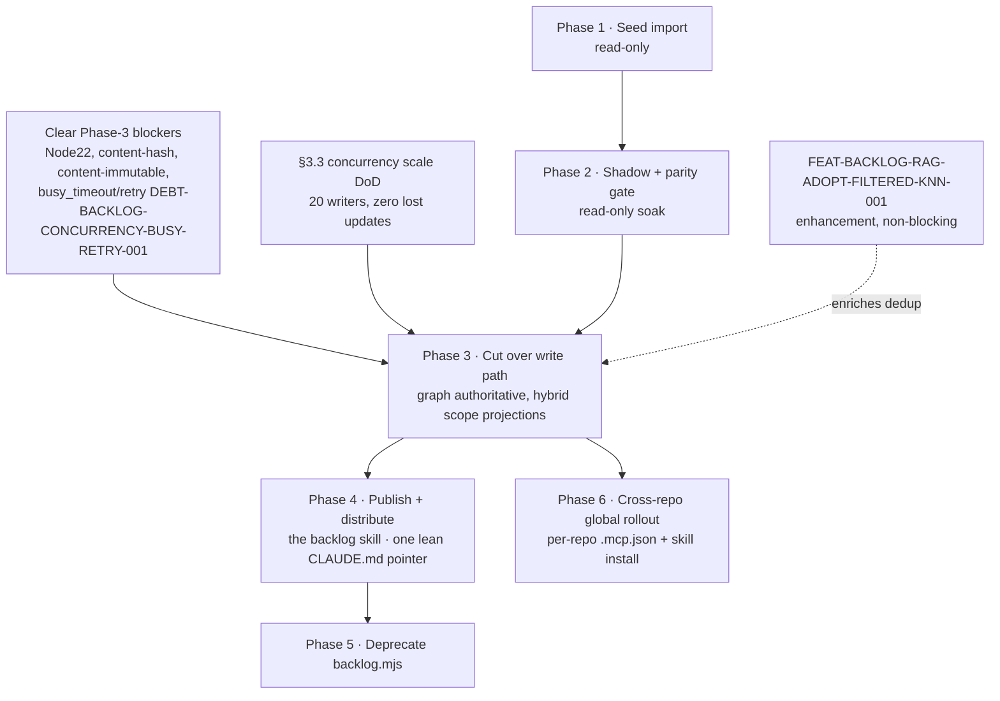

# Backlog Tool Adoption & Migration Plan

**Slug:** `backlog-adoption` · **Status:** Phases 1–2 EXECUTED (2026-07-24, real global store); Phase 3 BLOCKED on §5 · **Authored:** 2026-07-23
**Owner:** _unassigned_ · **Target tool:** `@adhd/backlog@0.0.1` (published)

Migrate this repo — and eventually every repo on the machine — from hand-edited
markdown `BACKLOG.md` files to the graph-backed, multi-agent, cross-repo
`@adhd/backlog` tool as the **source of truth**, with `BACKLOG.md` demoted to a
generated, git-visible *projection* of the graph.

**Execution status (2026-07-24):** Phase 1 (seed import) and Phase 2 (shadow
parity-check) below have been run for real against the machine's `global`-scope
store (`~/.adhd/backlog/production/data/backlog.db`) — 192 items imported from
14 of this repo's markdown sources (idempotency and export-count proven; see
`projection-manifest.json`/`parity-check.mjs`, committed alongside this file).
`packages/apigen/**` was deliberately excluded this run (a separate,
concurrent apigen orchestration owns that tree) and must be imported in a
follow-up pass. **Phase 3 (write-path cut-over) is still BLOCKED** — all four
gating blockers in §5 remain OPEN in the repo-root `BACKLOG.md` as of this
execution — so `BACKLOG.md` (root, per-plan, per-package) remains the
authoritative source and the disclosure rules in `AGENTS.md` are UNCHANGED:
continue hand-editing `BACKLOG.md` by hand until Phase 3 is explicitly
executed.

---

## 0. Why migrate at all

The markdown backlog has three structural limits the tool removes:

1. **Concurrent-edit hazard.** `BACKLOG.md` is one file on a shared git index;
   the whole `feedback_commit_pathspec_not_add` / "swept-in files" class of bug
   exists *because* many agents edit one markdown file. A graph store with
   atomic per-item mutation + CAS claims removes the file-level contention
   entirely.[1]
2. **No cross-repo view.** A markdown file is per-repo. `@adhd/backlog` defaults
   to **`global` scope** — one shared graph spanning every repo on the machine
   (`entrypoint/backlog/src/env.ts:46-53` defaults scope to `global`, deliberately
   *not* the generic project-marker default).[2]
3. **No structured query / dedup / RAG.** "Dedupe before filing" (a standing
   `AGENTS.md` mandate) is eyeballed today. The tool gives FTS + symbol dedup now,
   and — once `FEAT-BACKLOG-RAG-ADOPT-FILTERED-KNN-001` lands — *semantic* dedup.

**Non-goals of this migration:** implementing the RAG layer (tracked separately,
now unblocked); changing the *content* of any backlog item; changing the ID
vocabulary or the `Citations:` disclosure standard (those carry over verbatim).

---

## 1. Current architecture (what exists today)

| Piece | State | Evidence |
|---|---|---|
| `@adhd/backlog` client (34 ops) | published `0.0.1` | `entrypoint/backlog/src/client.ts` |
| HTTP + MCP transports (apigen live mount) | working | `entrypoint/backlog/src/server.ts` |
| **CLI transport** | **in flight this session** | `entrypoint/backlog/src/cli.ts` (being added) |
| `importFromMarkdown(ctx, input)` | implemented | `client.ts:234`[3] |
| `renderToMarkdown(ctx, filter?)` | implemented | `client.ts:277`[3] |
| `archiveResolved(ctx, scope, opts?)` | implemented | `client.ts:184`[3] |
| Round-trip parity vs legacy parser | **proven green** | `src/markdown.spec.ts` re-parses a `renderToMarkdown` output with the real `tools/util/backlog.mjs` subprocess and asserts every id/status/priority survives[4] |
| Graph store (SQLite, global scope) | working | `store/graph-backlog-store.ts`, sox-graph-store `^0.3.0` |
| Legacy parser CLI | still in use | `tools/util/backlog.mjs` (17.9 KB)[5] |

The migration's **enabling mechanism already exists and is tested**: the graph
and `BACKLOG.md` are inter-convertible without loss. What is missing is the
*process* cut-over, not the plumbing.

**CLI transport, verified concretely (2026-07-23 extension).** `cli.ts` mounts
`@adhd/apigen-plugin-cli-output` the same way `server.ts` mounts fastify/mcp —
`runBacklogCli(argv)` opens env → store → ctx, builds the composed apigen
package, and dispatches exactly one command per process invocation, closing the
store on exit (`cli.ts:123-144`).[13] The real, spawned-subprocess test suite
(`cli.spec.ts`, which spawns the **built** `dist/index.js`, never an in-process
import[14]) establishes the actual user-facing flag convention, which the rest
of this document relies on:

- **Scalar parameters get individual kebab-case flags**, named after the
  parameter itself: `getItem(ctx, repo, humanId)` → `backlog get-item --repo
  <repo> --human-id <id>` (`cli.spec.ts:189-196`).[14]
- **Object-shaped parameters get a single JSON-blob flag**, named after the
  *parameter's own name*, kebab-cased: `createItem(ctx, input)` → `backlog
  create-item --input '<json>'` (`cli.spec.ts:228-236`); `listItems(ctx,
  filter?)` → `backlog list-items --filter '<json>'` (`cli.spec.ts:252-260`).[14]
  This rule is verified for exactly these two ops; every other object-shaped
  parameter is expected, by the same convention, to follow it — but is **not
  independently verified** per-op until its own `cli.spec.ts` case exists (see
  §4's command-surface table caveat).
- The bin name is never part of `argv` (`process.argv.slice(2)`); a bare
  `create-item …`/`get-item …` resolves without any manual namespace prefix —
  `runBacklogCli` injects the real internal `['backlog','client-d']` prefix
  itself (`cli.ts:63-98`, empirically verified not assumed — see that file's
  own extensive doc comments).[13]
- Failures use real process exit codes, never `0` on error (`cli.spec.ts:264-273`
  — unknown command → exit `4`, bad flag → exit `2`), and errors are JSON on
  the last stderr line.

---

## 2. Scope model — one global graph of record, filtered projections everywhere else

**Decision: hybrid.** Write to exactly **one `global`-scope store** (the tool's
own default[2]); keep every existing per-repo/per-plan/per-package `BACKLOG.md`
as a `renderToMarkdown(ctx, filter)`-**filtered projection** of that one store,
never as an independent per-project database.

### 2.1 Grounding

- `env.ts:46-53`/`resolveBacklogScope` resolves scope as: explicit option →
  `ADHD_BACKLOG_SCOPE` → `ADHD_ENV_SCOPE` → **default `'global'`**.[2] SPEC.md §3
  states this is a **deliberate override** of `@adhd/environment`'s own generic
  auto-detect default (project-marker-found ⇒ `project`) specifically because a
  silent per-repo split would defeat the tool's cross-repo requirement.[6]
- SPEC.md §3 states plainly: **"Cross-scope aggregation: not supported in v0.1.
  A `project`-scoped store and the `global` store are two entirely separate
  SQLite files with no sync between them."**[6] This limitation is about two
  independent *stores* (project-scope DB vs. global-scope DB) — it says nothing
  about filtering one store's contents for different *views*, which is a
  first-class, already-implemented capability (`BacklogFilter`/`StatsScope`,
  `client.ts` §5.1/§5.2).[3] The hybrid model below never triggers this
  limitation because there is only ever one physical database.
- Every `BacklogItem` already carries the exact three fields needed to
  reconstruct the existing per-repo/per-plan/per-package markdown convention as
  filters over the one graph: `repo` (stable git-remote-derived slug, e.g.
  `PseudoSky/adhd` — SPEC.md §3 "Repo identity"[6]), `projectPath` (package-
  relative path, e.g. `packages/apigen/apigen-core-client`[7]), and `plan`
  (plan slug, attached via `attachToPlan`[3]).
- `DESIGN.md` §14 point 1 (verified against the real `@adhd/sox-graph-store`
  source, not assumed) confirms `projectPath` and `repo`/`namespace` are
  **first-class indexed `NodeFilter` columns**, not `metadata` JSON scans[8] —
  so filtering by project/plan/repo is cheap at scale, not a workaround.
- Worktree handling: items filed from a plan agent working in
  `<repo>/.worktrees/*` resolve to the **main** repo's toplevel `repo` slug, not
  a phantom per-worktree repo (SPEC.md §3, mirroring the plan-state-machine
  skill's own `mainRepoRoot()` handling of the identical case).[6] This matters
  for the hybrid model because it means a worktree agent's writes land in the
  *same* projection as the main checkout's, not a fork.

### 2.2 The mapping (existing markdown → filtered projection)

| Existing markdown location | Filter that reproduces it | `renderToMarkdown` call shape |
|---|---|---|
| Root `BACKLOG.md` | `repo`-only, no `projectPath`/`plan` | `renderToMarkdown(ctx, { repo: 'PseudoSky/adhd' })`, then drop items that also carry a `projectPath`/`plan` (repo-level items only) |
| `docs/plan/<slug>/BACKLOG.md` | `repo` + `plan: <slug>` | `renderToMarkdown(ctx, { repo, plan: slug })` |
| `packages/<domain>/<pkg>/BACKLOG.md` | `repo` + `projectPath: 'packages/<domain>/<pkg>'` | `renderToMarkdown(ctx, { repo, projectPath })` |
| `entrypoint/<name>/BACKLOG.md` | `repo` + `projectPath: 'entrypoint/<name>'` | `renderToMarkdown(ctx, { repo, projectPath })` |

Filing an item at any of these existing locations becomes `createItem(ctx, {
..., repo, projectPath?, plan? })` with the matching fields stamped — the exact
same fields the item would already need for its `repo`/`family` id allocation,
so this is not new bookkeeping, only making explicit what the file location
already implied.

### 2.3 Why hybrid over the two alternatives

- **Project-level-only (rejected).** Defeats the tool's own stated cross-repo
  requirement #3/#4[6] and its chosen default. This machine already runs agents
  across multiple repos in one task (e.g. `adhd` and `sox-ecosystem` — see this
  session's own grounding reads under `/Users/nix/dev/ai/sox-ecosystem`); an
  agent working cross-repo under N independent project DBs could double-file
  the same cross-cutting item once per repo, and dedupe/claim coordination
  would need to run N times instead of once. It also multiplies "which DB is
  this agent even talking to" bookkeeping for no correctness gain.
- **Global-only, no per-project view (rejected).** Loses the existing,
  reviewable, git-blamed, PR-diffable `BACKLOG.md`-per-package/per-plan
  convention this repo already relies on (CLAUDE.md's own disclosure rules
  reference `docs/plan/<plan>/BACKLOG.md` explicitly). A pure global blob with
  no filtered rendering would make "what does *this* package/plan still owe"
  unanswerable without a query, which is a real workflow regression for a
  human skimming a PR diff.
- **Hybrid (recommended).** Zero new storage — one SQLite file, existing
  indexed filter columns, existing `renderToMarkdown`/`importFromMarkdown`
  functions. The only "new" mechanism is a manifest of `{sourcePath, filter}`
  pairs (one row per existing markdown file location) that the Phase-3 render
  hook iterates — a config list, not a new architecture. Isolation is
  preserved at the *view* layer (each package's `BACKLOG.md` only shows its
  own slice) while cross-repo visibility and single-graph dedupe/claim
  coordination are preserved at the *storage* layer.

**Trade-off called out honestly:** the render step must now run once per
projection file instead of once for the whole graph (Phase 3 step 2's commit
hook becomes an N-iteration loop over the manifest, not a single call) — a
config-driven multiplication of an already-planned mechanism, not a new one.

### 2.4 DoD (teeth)

For each of the four location kinds in §2.2, seed a real item via `createItem`
with the matching `repo`/`projectPath`/`plan`, then assert
`renderToMarkdown(ctx, <that row's filter>)` contains it **and**
`renderToMarkdown(ctx, <a sibling row's filter>)` does **not** — proving
isolation is real, not accidental (a filter that silently matched everything
would pass a positive-only test). Extends the existing `markdown.spec.ts`
round-trip fixture set rather than replacing it.

---

## 3. Concurrency model — serializing 20+ simultaneous agents

### 3.1 What is actually built today (read, not assumed)

- **CLI = one process per command.** `runBacklogCli` opens env → store → ctx,
  dispatches exactly one command through `cliPlugin.run()`, then closes the
  store — every invocation is a fresh `better-sqlite3` connection
  (`cli.ts:123-144`).[13]
- **HTTP/MCP server = one long-lived process, one store, opened once.**
  `startBacklogServer` opens the store a single time and hands a closure
  (`createClient: async () => ctx`) that returns the **same already-open**
  `BacklogCtx` on every dispatched call — `server.ts`'s own doc comment states
  this explicitly: `createClient` here is "the SAME already-open `BacklogCtx`
  on every call ... never something that re-opens the DB per request"
  (`server.ts:6-11, 235-239`).[9]
- **WAL + `busy_timeout` are already on, and are load-bearing.**
  `openGraphBacklogStore` sets `journal_mode = WAL` and `busy_timeout = 5000`
  unconditionally (`graph-backlog-store.ts:19-32`) with a comment explaining
  why: "the global-scope store is, by construction, opened by many concurrent
  processes/agents/repos. Without WAL a writer blocks all readers; without
  busy_timeout a blocked `.immediate()` throws SQLITE_BUSY immediately instead
  of waiting out a brief contention window."[10]
- **Every metadata mutation funnels through ONE atomic CAS primitive.**
  `mutateMetadata` (`store/mutate-metadata.ts:30-45`) wraps
  `db.transaction(fn).immediate()` around a read-current → compute-next →
  write-complete cycle. `.immediate()` (`BEGIN IMMEDIATE`, not the default
  deferred `BEGIN`) acquires SQLite's RESERVED lock **at transaction start**,
  not at the first write statement — so a second process's own `.immediate()`
  call **blocks** (up to `busy_timeout`) rather than interleaving through a
  read-check race window.[11] `claimItemNode`'s full branch table (unclaimed →
  claimed; same-claimant → always-renewed; other-claimant-not-stale →
  held/no-write; other-claimant-stale-or-forced → reclaimed) runs entirely
  *inside* this one transaction (`store/claim.ts:34-65`), so two concurrent
  claimants on the same item are serialized by SQLite's own lock, not by any
  application-level mutex.
- **The design's own stated position:** `DESIGN.md` §12 states outright
  "Single-writer-per-scope is NOT enforced at the DB layer — WAL supports
  multiple writers serialized through SQLite's own locking, which is
  sufficient correctness-wise (that's the whole point of the CAS design in
  §4)," and explicitly defers a single-server-process lock
  (`env.lock('singleton')`) as "out of scope for v0.1, noted for the
  implementer" — a deliberate, documented deferral, not an oversight.[12]

### 3.2 Recommendation: (b) direct-open, WAL + `busy_timeout` + bounded
retry/backoff for many one-shot CLI writers — **not** (a) a mandatory
single-server funnel

**Reject (a).** Forcing every agent through one long-lived server process
(CLI/other agents become clients only) would mean deleting or fundamentally
restructuring `cli.ts`'s entire one-shot, direct-open model — a real
regression against a design that is already built, tested
(`cli.spec.ts`[14]), and shipped, in order to buy a correctness property
(write serialization) that SQLite's own WAL locking **already provides**, per
§3.1's own citations. `DESIGN.md` §12 treats the single-server lock as a
*future* option for guaranteeing one **server process** binds a scope+port —
a different problem (avoiding two competing HTTP/MCP listeners) than "can 20
agents write safely," which the CAS design already answers.[12]

**Adopt (b).** 20 concurrent one-shot CLI writers is a modest load for
WAL + `busy_timeout`; SQLite's documented multi-writer model (readers never
block on WAL, writers serialize through the RESERVED lock, `busy_timeout`
absorbs brief contention) is designed for exactly this shape, and every
individual `mutateMetadata` transaction is short (one read + one compute + one
write, never a long-held lock across an await or network call). What is
**missing** today, and must be added before this scales safely, was found by
this review and filed as `DEBT-BACKLOG-CONCURRENCY-BUSY-RETRY-001`[15]:

1. **`busy_timeout` is hardcoded (5000ms) and unconfigurable** —
   `BacklogConfig`/`backlogEnvironmentSpec` (`env.ts:10-40`) exposes only
   `db.path` and `logging.level`, no busy-timeout knob.[10] Recommended fix:
   add `db.busyTimeoutMs` to the config spec (mirroring `db.path`'s shape),
   env-overridable via `ADHD_BACKLOG_DATABASE_BUSY_TIMEOUT_MS`, default `5000`
   unchanged.
2. **No retry/backoff around `.immediate()` at all.** `mutateMetadata` has no
   try/catch; a `SQLITE_BUSY`/`SQLITE_BUSY_TIMEOUT` thrown after the
   `busy_timeout` window is exhausted propagates straight to the caller (a
   crashing CLI process, or a 500 from the MCP/HTTP transport) instead of a
   clean, recoverable outcome.[15] Recommended fix: wrap the `.immediate()`
   call in a bounded, jittered exponential backoff (3-5 attempts, base ~100ms)
   that retries **only** on the specific `SQLITE_BUSY`/`SQLITE_BUSY_TIMEOUT`
   error code (`better-sqlite3` sets `.code`) — never on any other error, and
   never conflated with the semantic `'held'` claim-contention result (a
   correct non-error outcome that must never be silently retried into a false
   claim).

Both are layered, not redundant: `busy_timeout` handles sub-second contention
*inside* one open transaction attempt; the retry/backoff handles the case
where that single attempt's window is fully exhausted, giving a one-shot CLI
process a chance to re-attempt a **new** transaction instead of crashing.

**Concrete config for the 20+-agent target:**

| Setting | Value | Rationale |
|---|---|---|
| `journal_mode` | `WAL` (already set) | Required for concurrent readers + one writer; unconditional, not optional (`DESIGN.md` §12). |
| `busy_timeout` | 5000ms default, configurable (new) | Absorbs sub-5s contention inside one transaction attempt; must be raisable for higher concurrency without a code change. |
| Retry policy (new) | 3-5 attempts, ~100ms base, full jitter, `SQLITE_BUSY`/`SQLITE_BUSY_TIMEOUT` only | Recovers from a fully-exhausted `busy_timeout` window without turning a benign pileup into a crashed CLI process. |
| `better-sqlite3` synchronous API + `IMMEDIATE` transactions | sufficient, unchanged | Already the correct primitive per `DESIGN.md` §3/§4.3 — no async driver or connection pool needed; the synchronous API is what makes `.immediate()`'s lock-then-block-then-succeed semantics deterministic within one Node event-loop turn. |
| Single-server write funnel | **not adopted** | SQLite's own locking already serializes writers correctly (§3.1); a mandatory server would be a larger, riskier change for a property already satisfied. |

### 3.3 Scale DoD (teeth, provable without sleeps)

Extends the existing 2-writer CAS race test already documented in `DESIGN.md`
§13 ("Two real `better-sqlite3` connections to one temp file; a barrier ...
ensures both `claimItem` calls are in-flight before either commits — never a
`sleep`")[16] from 2 to 20 real writers:

1. **Setup.** Spin up 20 real writers against the **same** temp SQLite file —
   either 20 real `child_process` invocations of the built CLI, or 20 real
   `Worker` threads each opening its own genuine `better-sqlite3` connection
   (not simulated/mocked). Synchronize their start via a real barrier
   (`Atomics.wait`/a shared readiness pipe) — never `setTimeout`/`sleep`.
2. **Contention case.** All 20 race `claimItem` on the **same** single item.
   Reopen the store fresh afterward (a brand-new connection, not any writer's
   own handle) and assert: exactly **one** of the 20 calls returned
   `status:'claimed'`; the other 19 returned `status:'held'`. Two or more
   `'claimed'` results is the failing condition (a lost-update/double-claim).
3. **No-contention case.** All 20 call `createItem` for 20 **distinct** items
   (no shared key). Reopen the store and assert the node count is exactly 20 —
   zero dropped writes, zero duplicate ids.
4. **Bounded latency.** Record each writer's own wall-clock elapsed time for
   its call; assert the p99 stays under the configured `busy_timeout` (proving
   contention is *absorbed* by the timeout window, not silently truncated or
   starved) — this is a latency-envelope assertion, not a raw-speed benchmark.
5. **Negative control (proves the config is load-bearing).** Re-run case 2
   with `busy_timeout` set to ~0ms in a separate variant and confirm at least
   one of the 20 writers *does* throw `SQLITE_BUSY` — if this variant stayed
   green, the primary test was not actually proving `busy_timeout`'s effect.
6. **Retry/backoff proof (once `DEBT-BACKLOG-CONCURRENCY-BUSY-RETRY-001` is
   fixed).** Re-run case 2 with `busy_timeout` deliberately tiny (so the first
   attempt's window is exhausted) and confirm the retry/backoff still
   converges on exactly one `'claimed'` result with zero unhandled thrown
   errors across all 20 writers — proving the retry layer recovers from
   exhaustion rather than merely delaying the same crash.

Lives at `src/store/claim.spec.ts` (extending the existing suite) or a new
`src/store/concurrency-scale.spec.ts`, using a real temp file under
`tmp/backlog/` per `AGENTS.md` §10, removed on teardown — no mocks anywhere,
per `AGENTS.md` §7.

---

## 4. The backlog skill — design & distribution

**Hard constraint (restated):** migration-state and "how to correctly use the
backlog CLI" content does **not** go into the global `CLAUDE.md`/`AGENTS.md`.
It lives in a Claude Code **skill** shipped by and referenced from the
`@adhd/backlog` package. The global docs get **one lean pointer line**, nothing
more (exact text in §4.6).

### 4.1 Precedent surveyed in this repo/machine

Two real, working skill-distribution patterns exist today, read directly
rather than assumed:

1. **Project-local, hand-authored skill (`gitnexus`).** This repo's own
   `.claude/skills/gitnexus/*/SKILL.md` files: one directory per skill, YAML
   frontmatter with exactly `name` + `description` (the `description` is what
   the host uses to auto-surface the skill for a matching task — e.g.
   `gitnexus-impact-analysis`'s frontmatter: "Use when the user asks about
   blast radius..."), a single markdown body, referenced from `CLAUDE.md`'s own
   "## CLI" table by skill name (`.claude/skills/gitnexus/gitnexus-guide/SKILL.md`,
   `.claude/skills/gitnexus/gitnexus-impact-analysis/SKILL.md`, etc.).[17]
   These live **inside the repo** (`.claude/skills/`), so they are visible only
   to agents working in *this* checkout — not the cross-repo reach this task
   needs.
2. **Machine-global, package-distributed skill (`memory-usage`).** Read
   directly at `~/.claude/skills/memory-usage/`: a real directory (not a
   symlink) containing `SKILL.md` (frontmatter `name`+`description`, full
   how-to body), `README.md`, `CHANGELOG.md`, `package.json` (name
   `@adhd/sox-extension-memory-usage`, `version: 0.2.0`, published,
   `publishConfig.access: public`), and `extension.json` (`type: "skill"`,
   `entrypoint: "SKILL.md"`, `install: { type: "skill", hosts: ["claude",
   "opencode"] }`).[18] This skill is installed via `soxe install
   memory-usage` (README.md's own documented usage[19]) — `soxe` is a separate
   CLI (`/Users/nix/dev/ai/sox-ecosystem/bin/soxe`) that tracks installed
   extensions in `~/.adhd/sox-ecosystem/extensions.json`
   (`{"install":[{"id":"sox-memory-bundle"},{"id":"demo-creator"}]}` — the
   real, current install list on this machine[20]) and, per this repo's own
   already-surveyed `sox-host-registry` package, drops the installed skill
   files into the **exact per-host path table**: `.claude/skills/` (project) /
   `~/.claude/skills/` (user) for Claude Code, `.codex/skills/` (project) /
   `$CODEX_HOME/skills/` (user, default `~/.codex/skills/`) for Codex,
   `.opencode/skills/` (project) / `~/.config/opencode/skills`-equivalent for
   OpenCode.[21] Because `~/.claude/skills/` is **user-scope**, a skill
   installed there is visible to every repo's Claude Code session on the
   machine — this is the actual, already-working mechanism by which
   `memory-usage` (a cross-repo tool exactly like `@adhd/backlog`) reaches
   every repo today, and it is the right shape to copy.

### 4.2 Recommended design: skill content lives *inside* `@adhd/backlog`'s own
published package; a `backlog install-skill` CLI subcommand distributes it

**Ownership.** `entrypoint/backlog/skill/SKILL.md` (a new plain file, no new nx
project) is the **single source of truth** for the skill's content, versioned
in lockstep with `client.ts` in the exact same commit and the exact same
publish as the rest of `@adhd/backlog` — added to the package's `files` array
in `package.json` alongside `dist`/`CHANGELOG.md`.[22] This is what "the
package is the owner, the skill is referenced by the package" means
concretely: there is no second repo, no second version number, and no
possibility of the skill's command-mapping table drifting from the real
`client.ts` surface across a release, because they ship in the same tarball.

**Distribution.** A new CLI-only subcommand, `backlog install-skill [--host
claude|codex|opencode|all] [--scope user|project]` (default `--host all
--scope user`), copies the packaged `skill/SKILL.md` (plus a thin
`extension.json`, matching the `memory-usage` precedent's shape[18] for hosts
that consume it) into the exact per-host path table already verified in this
repo's own `sox-host-registry` survey[21]:

| Host | User scope (default) | Project scope (`--scope project`) |
|---|---|---|
| Claude Code | `~/.claude/skills/backlog/` | `.claude/skills/backlog/` |
| Codex | `$CODEX_HOME/skills/backlog/` (default `~/.codex/skills/backlog/`) | `.codex/skills/backlog/` |
| OpenCode | OpenCode user skills dir | `.opencode/skills/backlog/` |

This is a **pure filesystem operation** (read a packaged file, write it to a
resolved host path) — it does not need apigen dispatch/schema extraction like
the 34 `client.ts` ops, so it is implemented directly in `cli.ts`'s argv
handling as a special-cased subcommand, the same way `cli.ts` already
special-cases `--help`/`-h` before ever consulting the apigen command table
(`cli.ts:92-98`).[13] Running it **once, at `--scope user` (the default), on
one machine** reaches every repo's Claude Code / Codex / OpenCode agents on
that machine — a single global install, mirroring the tool's own "global by
default" posture (§2) rather than a per-repo step.

**Why not the `sox-extension-*` package-per-skill pattern as primary.** It is
real and it works (§4.1.2), but adopting it here as the *primary* mechanism
would mean: (a) a **second published package** (`@adhd/sox-extension-backlog-
usage` or similar) whose version must be bumped in lockstep with
`@adhd/backlog`'s own `client.ts` — precisely the kind of two-artifact drift
this whole migration exists to eliminate (§0 point 1); and (b) a **hard
dependency on the external `soxe` CLI**, which lives in a different repo
(`sox-ecosystem`, not `adhd`) — adopting a new external tool as the *only*
install path requires human approval per this repo's own `CLAUDE.md` ("You
always get human approval before installing external tools"). The
in-package + `install-skill` design needs zero new dependencies and zero new
packages. **Open decision (§9):** if the human wants `soxe` standardized as
the *one* skill installer across the whole machine regardless of source
repo, the `sox-extension-backlog-usage` wrapper can be added *later* as an
**additional**, not replacement, distribution path — it would simply invoke
the same packaged `skill/SKILL.md` as its content, via a build step that
copies `entrypoint/backlog/skill/SKILL.md` into that wrapper package at
publish time, preserving the single-source-of-truth property either way.

**No new package tier needed.** `entrypoint/backlog/skill/` is a plain
directory of static files inside the *existing* `entrypoint/backlog` nx
project — it does not need a new `workspace-codegen-nx` generator tier (the
existing tier vocabulary — types/base/core/engine/store/plugin/generator/query
— has no "skill" or "static asset" shape, and inventing one for a single
directory of markdown would be over-engineering per this repo's own "Two-Use
Refactor Rule": this is a one-off need until a second package needs the same
shape). Flagged as an open decision in §9 in case a second tool later wants
the identical pattern.

### 4.3 Content outline

`entrypoint/backlog/skill/SKILL.md` frontmatter mirrors the two precedents
exactly (`name` + `description` only — both `gitnexus-*`[17] and
`memory-usage`[18] use this minimal shape):

```yaml
---
name: backlog-usage
description: "Use whenever filing, claiming, transitioning, or resolving a backlog item (bug/debt/feature) in ANY repo on this machine — via the `backlog` CLI/MCP, never by hand-editing a BACKLOG.md file. Also use to check current migration status before assuming markdown vs. the tool is authoritative."
---
```

Body sections:

1. **Migration-state check, first, every time.** Never trust a hardcoded phase
   number in this document — it goes stale the moment a phase advances. Run
   `backlog migration-status` (proposed new read-op, §4.4) before deciding
   whether `BACKLOG.md` or the tool is authoritative for the current repo.
2. **Command surface — the 34 `client.ts` ops mapped to their CLI form**, per
   the verified convention in §1: scalar params → individual `--kebab-case`
   flags; object params → one `--param-name '<json>'` flag. Table (op →
   CLI, grouped by SPEC.md §5's own sections):

   | `client.ts` export | CLI form |
   |---|---|
   | `createItem(ctx, input)` | `backlog create-item --input '<CreateItemInput json>'` *(verified — `cli.spec.ts:228-236`)* |
   | `getItem(ctx, repo, humanId)` | `backlog get-item --repo <repo> --human-id <id>` *(verified — `cli.spec.ts:189-196`)* |
   | `updateItem(ctx, repo, humanId, patch)` | `backlog update-item --repo <repo> --human-id <id> --patch '<UpdateItemInput json>'` |
   | `listItems(ctx, filter?)` | `backlog list-items --filter '<BacklogFilter json>'` *(verified — `cli.spec.ts:252-260`)* |
   | `softDeleteItem(ctx, repo, humanId, reason)` | `backlog soft-delete-item --repo <repo> --human-id <id> --reason <text>` |
   | `stats(ctx, scope?)` | `backlog stats --scope '<StatsScope json>'` |
   | `spotlight(ctx, scope?, limit?)` | `backlog spotlight --scope '<json>' --limit <n>` |
   | `readyItems(ctx, scope?)` | `backlog ready-items --scope '<json>'` |
   | `blockers(ctx, repo, humanId)` | `backlog blockers --repo <repo> --human-id <id>` |
   | `dependencyGraph(ctx, scope?)` | `backlog dependency-graph --scope '<json>'` |
   | `topoOrder(ctx, scope?)` | `backlog topo-order --scope '<json>'` |
   | `staleClaims(ctx, maxAgeMin, scope?)` | `backlog stale-claims --max-age-min <n> --scope '<json>'` |
   | `claimItem(ctx, repo, humanId, by, opts?)` | `backlog claim-item --repo <repo> --human-id <id> --by <identity> --opts '<ClaimOpts json>'` |
   | `renewClaim(ctx, repo, humanId, by)` | `backlog renew-claim --repo <repo> --human-id <id> --by <identity>` |
   | `releaseClaim(ctx, repo, humanId, by, opts?)` | `backlog release-claim --repo <repo> --human-id <id> --by <identity> --opts '<json>'` |
   | `assignItem(ctx, repo, humanId, to, by)` | `backlog assign-item --repo <repo> --human-id <id> --to <identity> --by <identity>` |
   | `startWork(ctx, repo, humanId, by)` | `backlog start-work --repo <repo> --human-id <id> --by <identity>` |
   | `transitionStatus(ctx, repo, humanId, status, opts)` | `backlog transition-status --repo <repo> --human-id <id> --status <STATUS> --opts '<TransitionOpts json>'` |
   | `addCitation(ctx, repo, humanId, citation)` | `backlog add-citation --repo <repo> --human-id <id> --citation '<Citation json>'` |
   | `appendNote(ctx, repo, humanId, by, text)` | `backlog append-note --repo <repo> --human-id <id> --by <identity> --text <note>` |
   | `resolveItem(ctx, repo, humanId, status, opts)` | `backlog resolve-item --repo <repo> --human-id <id> --status <STATUS> --opts '<json>'` |
   | `archiveResolved(ctx, scope, opts?)` | `backlog archive-resolved --scope '<StatsScope json>' --opts '<ArchiveOpts json>'` |
   | `addDependency(ctx, repo, humanId, dependsOnHumanId)` | `backlog add-dependency --repo <repo> --human-id <id> --depends-on-human-id <id2>` |
   | `removeDependency(ctx, repo, humanId, dependsOnHumanId)` | `backlog remove-dependency --repo <repo> --human-id <id> --depends-on-human-id <id2>` |
   | `linkRelated(ctx, repo, humanIdA, humanIdB)` | `backlog link-related --repo <repo> --human-id-a <id1> --human-id-b <id2>` |
   | `supersedeItem(ctx, repo, oldHumanId, newInput, reason)` | `backlog supersede-item --repo <repo> --old-human-id <id> --new-input '<CreateItemInput json>' --reason <text>` |
   | `splitItem(ctx, repo, parentHumanId, children)` | `backlog split-item --repo <repo> --parent-human-id <id> --children '<CreateItemInput[] json>'` |
   | `mergeItems(ctx, repo, keepHumanId, dropHumanId, reason)` | `backlog merge-items --repo <repo> --keep-human-id <id1> --drop-human-id <id2> --reason <text>` |
   | `setPriority(ctx, repo, humanId, priority)` | `backlog set-priority --repo <repo> --human-id <id> --priority <PRIORITY>` |
   | `attachToPlan(ctx, repo, humanId, planSlug)` | `backlog attach-to-plan --repo <repo> --human-id <id> --plan-slug <slug>` |
   | `importFromMarkdown(ctx, input)` | `backlog import-from-markdown --input '<ImportMarkdownInput json>'` |
   | `renderToMarkdown(ctx, filter?)` | `backlog render-to-markdown --filter '<BacklogFilter json>'` |
   | `exportJson(ctx, filter?)` | `backlog export-json --filter '<json>'` |
   | `auditTrail(ctx, repo, humanId)` | `backlog audit-trail --repo <repo> --human-id <id>` |

   **Caveat carried into the skill itself, verbatim:** only the two rows marked
   *(verified)* have been driven through the real spawned CLI; every other row
   follows the same documented parameter-naming convention (`client.ts`'s own
   parameter names, kebab-cased) but has not been independently exercised.
   Before the skill is published, extend `cli.spec.ts` with at least one
   round-trip case per remaining row, or soften rows that fail to the
   convention actually observed.

3. **Claim/renew/release protocol for multi-agent use** — restated from
   `DESIGN.md` §4 rather than re-derived: identity is always
   `${agentName}:${instanceId}` (never a bare role literal like `"agent"` —
   two concurrent agents both claiming as `"implementer"` defeats the CAS
   protocol[6]); `claimItem` is idempotent for the same claimant (always
   `renewed`, no contention check); a long-running task must call
   `renewClaim` periodically (default staleness: 30 minutes[11]); every exit
   path (done/error/abandoned) calls `releaseClaim` unconditionally — it is a
   no-op on an already-unclaimed item, never an error.[11]
4. **`Citations:` disclosure standard restated as tool calls, not hand
   formatting.** The `Citation` type (`file`, optional `lines`, optional
   `context`) is structurally identical to one bracketed citation entry in the
   existing markdown convention[7] — the skill instructs: call
   `transitionStatus(..., { citations: [...] })` when moving into any
   terminal-done/terminal-workaround status (required, enforced —
   `requiresCitation`[7]), or `addCitation` to attach evidence without a
   status change, instead of hand-typing a `Citations: [...]` line.
5. **Dedupe-before-filing via the tool, not eyeballing.** `createItem`
   dedupe-scans (FTS + symbol/path/errorText metadata match) **before**
   writing and returns `duplicateCandidates` alongside `created: false` when a
   likely match exists[3] — the skill instructs: always inspect
   `duplicateCandidates` first; only pass `force: true` after confirming the
   candidates are genuinely distinct.
6. **Migration-state awareness (see §4.4 for the mechanism).**

### 4.4 Migration-state signal — must be queried, never hardcoded in prose

A static "Phase N is current" sentence in `SKILL.md` **will** go stale the
moment a phase advances, and the skill's own package/publish cadence will
usually lag a phase transition. Recommend a new, small, machine-readable
signal instead of prose: add a `migration.phase` config key to
`backlogEnvironmentSpec.config` (`env.ts`, mirroring the existing `db.path`
field shape[10]) — a plain string (`'not-started' | 'phase-1' | 'phase-2' |
'phase-3' | 'phase-4' | 'phase-5' | 'complete'`), default `'not-started'`,
settable via `ADHD_BACKLOG_MIGRATION_PHASE` or a `backlog set-migration-phase
<phase>` admin CLI call run by whoever executes each phase's DoD. Expose a
read-only `backlog migration-status` CLI subcommand (and, if it is added to
`client.ts`, an `mcp__backlog__migration_status` MCP tool) that reports the
current value plus a one-line human-readable meaning ("phase-2: BACKLOG.md is
still authoritative; the tool is shadow-running in parity-check mode").
`SKILL.md`'s §1 instructs every agent to call this **before** deciding whether
to hand-edit markdown or use the tool — making the skill self-correcting
across phase transitions instead of a snapshot that must be manually kept in
sync with plan execution. This is new scope, tracked as part of Phase 4 below
(§5, Phase 4 step 2) — not yet built, and not part of the existing 34
`client.ts` ops enumerated in §1/§4.3.

### 4.5 Discovery — steering agents to the skill without global-doc clutter

- **The one lean pointer** (§4.6) in `CLAUDE.md`/`AGENTS.md`'s Disclosure
  section — a single sentence, no usage prose, no phase state.
- **Skill auto-surfacing.** Claude Code (and, per the `sox-host-registry`
  survey, Codex/OpenCode via their own skill directories[21]) matches a
  skill's frontmatter `description` against the current task and injects it
  automatically — the exact mechanism this repo's own `gitnexus-*` skills and
  the `memory-usage` skill already rely on (`memory-usage`'s own README:
  "The host injects this skill when an agent is about to research, decide, or
  answer"[19]). `backlog-usage`'s `description` (§4.3) is written to match on
  "filing/claiming/transitioning/resolving a backlog item" — the same verbs
  the current hand-edit disclosure rules use — so it fires in the same
  situations the markdown rules used to.
- **`.mcp.json` wiring.** Add a `backlog` stdio entry to this repo's
  `.mcp.json`, in the exact same shape as the existing `agent-mcp`/
  `agent-mcp-published` entries already there (`command: "node"`/`"npx"`,
  `args`, `env`) — so `mcp__backlog__*` tools are loaded automatically for
  every session in this repo, without any global-doc prose. (Other repos on
  the machine each need their own `.mcp.json` entry — this is a per-repo,
  one-line config change, not a global-doc change, and is exactly the kind of
  thing the skill itself can remind an agent to check for, rather than the
  global docs prescribing it.)

### 4.6 Exact global-doc pointer text (the ONLY change to `CLAUDE.md`/`AGENTS.md`)

Replace the current `## Disclosure` section's backlog-editing instructions
(the "Backlog" bullet in `CLAUDE.md`'s `## Disclosure` section) with exactly
one line:

> **Backlog** File, claim, transition, and resolve backlog items via the
> `backlog` CLI/MCP — see the `backlog-usage` skill for the full protocol.
> Never hand-edit a `BACKLOG.md` file once the skill confirms the tool is
> authoritative for the current repo/phase.

No command list, no phase table, no citation-format restatement — all of that
lives in the skill (§4.3), not here. This is what Phase 4 (§5) implements.

---

## 5. Prerequisites / blockers (must clear before the write-path cut-over)

These gate **Phase 3+** (making the tool authoritative). Phases 1–2 (import +
shadow) can proceed today because they are read-only against the markdown.

| Blocker | ID | Gates | Why |
|---|---|---|---|
| Tool requires Node ≥22; CI pinned to Node 20 | `DEBT-BACKLOG-CI-NODE22-001` (`BACKLOG.md:1103`)[6] | Phase 3 | Agents/CI can't run the tool until the runtime matches |
| Global content-hash dedupe silently collides unrelated items with identical normalized title+body | `DEBT-BACKLOG-CONTENT-HASH-COLLISION-001` (`:1140`)[6] | Phase 3 | An authoritative store must not merge two real distinct bugs |
| `updateItem` can't refresh FTS `content` after a title/body edit | `DEBT-BACKLOG-CONTENT-IMMUTABLE-001` (`:1147`)[6] | Phase 3 | Editing an item is a core write-path op |
| `auditTrail` derives history from durable fields, not a full event log | `DEBT-BACKLOG-AUDIT-TRAIL-PARTIAL-001` (`:1154`)[6] | Phase 4 (nice-to-have for provenance) | Weakens the "who changed what" story vs git blame on markdown |
| Where the **global** DB lives + multi-agent write coordination across repos | resolved by §2/§3 above | Phase 3 (global), Phase 6 | A shared cross-repo DB needs an agreed, backed-up location — see §2/§9 |
| **`busy_timeout` unconfigurable + no retry/backoff on `SQLITE_BUSY`** (new, §3.2) | `DEBT-BACKLOG-CONCURRENCY-BUSY-RETRY-001` (`BACKLOG.md`, filed 2026-07-23)[15] | Phase 3 (at scale — 20+ agent target specifically) | A CAS-correct store that throws unhandled errors under real contention is not yet safe for the concurrency target this migration commits to (§3) |
| `migration.phase` signal does not exist yet (new, §4.4) | tracked in this plan, not yet filed as a separate `BACKLOG.md` item — it is new *feature* scope for Phase 4, not a defect in shipped code | Phase 4 | Without it, the skill's migration-state guidance is a static string that goes stale the moment a phase advances |
| Semantic dedup (RAG) unimplemented | `FEAT-BACKLOG-RAG-ADOPT-FILTERED-KNN-001` | **NOT a blocker** | FTS/symbol dedup is sufficient for cut-over; RAG is an enhancement |

**Rule:** do not begin Phase 3 until every Phase-3-gating row above is RESOLVED
in `BACKLOG.md`/`CHANGELOG.md`. This plan does not hand-wave them.

---

## 6. Phases

Each phase has a **goal**, **steps**, a **Definition of Done with teeth** (a
concrete observable that fails if the phase regressed — per `AGENTS.md` §7), and
a **rollback**.

### Phase 1 — Seed (idempotent import, read-only)

**Goal:** load every existing markdown backlog into the global graph without
touching any `BACKLOG.md`.

**Steps:**
1. Enumerate every source: root `BACKLOG.md`, `docs/plan/*/BACKLOG.md`,
   `packages/**/BACKLOG.md`, `entrypoint/**/BACKLOG.md`.
2. For each, `importFromMarkdown(ctx, { markdown, sourcePath })` into the
   `global`-scope store, stamping `repo`/`projectPath`/`plan` per the §2.2
   mapping table so the imported items are correctly filterable from day one.
   Import must be **idempotent** — re-running maps the same item id to the
   same node (upsert by stable ID), never a duplicate.
3. Record the source path on each node (provenance for the reverse render).

**DoD (teeth):** after import, `exportJson(ctx)` count == the union of unique IDs
across all source markdown files (parsed by the legacy `tools/util/backlog.mjs`
as the independent oracle); **re-running the import a second time changes the
node count by 0** (idempotency proof). A negative control — deliberately
corrupting one item's ID mid-file — must surface as an import diagnostic, not a
silent drop. Additionally (new, §2.4): for each of the four location kinds,
`renderToMarkdown(ctx, <that row's filter>)` contains the seeded item and a
sibling row's filter does not.

**Rollback:** delete the seeded graph DB file. Zero markdown touched, so rollback
is `rm <db>`.

### Phase 2 — Shadow / dual-run + parity gate

**Goal:** prove the graph can regenerate byte-equivalent markdown, continuously,
while humans/agents still edit `BACKLOG.md` by hand.

**Steps:**
1. Add a **read-only** check (nx target or CI job): for each `{sourcePath,
   filter}` pair in the §2.2 manifest, `renderToMarkdown(ctx, filter)` → diff
   against that pair's live markdown file. The diff is expected to be
   *semantically* empty (same items/status/priority), tolerating only
   formatting the render normalizes.
2. Run it in CI as a **non-blocking** report for a soak period (≥1–2 weeks of
   real edits) to surface every case where the render and the hand-edited file
   disagree, and fix the renderer/importer until they converge.
3. Keep `BACKLOG.md` (and every per-project/per-plan projection) authoritative
   throughout — set `migration.phase` (§4.4) to `'phase-2'` so
   `backlog migration-status` correctly reports this.

**DoD (teeth):** for N consecutive CI runs over real edits, every
`{sourcePath, filter}` pair's `renderToMarkdown` output re-parsed by
`tools/util/backlog.mjs` yields the **identical** `{id → (status, priority)}`
map as parsing that pair's hand-edited markdown file — extending the existing
`markdown.spec.ts` round-trip proof[4] from a fixture to the *live evolving*
files, across every projection, not just the root file. A single unreconciled
divergence, in any projection, fails the gate.

**Rollback:** the check is read-only; disable the CI job. Nothing to revert.

### Phase 3 — Cut over the write path

**Goal:** the graph becomes the source of truth; every `BACKLOG.md` (root,
per-plan, per-package) becomes a generated artifact.

**Preconditions:** every Phase-3-gating blocker in §5 RESOLVED, including the
new `DEBT-BACKLOG-CONCURRENCY-BUSY-RETRY-001` fix and the §3.3 scale DoD
passing at 20+ simulated concurrent writers.

**Steps:**
1. Agents/humans write via the tool surface — the **CLI** (`backlog create-item …`,
   `backlog transition-status …`), the **MCP** tools (`mcp__backlog__*`), or the
   HTTP API — never by hand-editing markdown.
2. A commit hook (or an explicit `nx run backlog:render` target) iterates the
   §2.2 manifest and regenerates every `{sourcePath}` from its own
   `{filter}` via `renderToMarkdown` on each change, committing each as a
   **projection** (git-visible, diffable, but machine-owned).
3. `CHANGELOG.md` on resolve continues via `archiveResolved`[3] (the tool already
   models the "completed items move to CHANGELOG" rule).
4. Set `migration.phase` (§4.4) to `'phase-3'`.

**DoD (teeth):** a fresh `backlog create-item` (via the shipped CLI/MCP, driven
as a consumer does — not an in-process test shim) appears in the regenerated
`BACKLOG.md` after the render step, with a passing round-trip; and a hand-edit to
any projection markdown that is *not* reflected in the graph is detected + rejected by the
Phase-2 gate (now promoted to **blocking**). Prove the write path end-to-end
through the real built artifact, per the MCP-server verification standard in
`AGENTS.md` §7 ("drive the real tools, never a bypass"). Additionally: the
§3.3 concurrency scale DoD (20 writers, zero lost updates, bounded p99, both
positive and negative control) is green.

**Rollback:** re-designate every markdown projection authoritative (each is
always a complete, valid markdown file because it was generated from the full
graph), stop the render hook, revert the `CLAUDE.md`/`AGENTS.md` pointer line
(Phase 4). Because every projection is always a lossless superset, rollback
loses nothing.

### Phase 4 — Publish + distribute the backlog skill

*(Revised from "Rewire the disclosure rules" — the skill, not the global docs,
is now the delivery vehicle; see §4 for the full design this phase
implements.)*

**Goal:** make the tool the *documented* path via a discoverable, versioned
skill — never via global-doc prose — so agents stop hand-editing markdown.

**Steps:**
1. Author `entrypoint/backlog/skill/SKILL.md` per §4.3's content outline;
   add it to `@adhd/backlog`'s `package.json` `files` array.
2. Implement the `migration.phase` config key + `backlog migration-status`
   read (§4.4) and the `backlog install-skill` CLI subcommand (§4.2) — both
   new, small additions to `entrypoint/backlog` (the config key mirrors
   `db.path`'s existing shape in `env.ts`; the CLI subcommand is a filesystem
   op special-cased in `cli.ts` alongside its existing `--help` handling, not
   an apigen-dispatched `client.ts` export).
3. Replace `CLAUDE.md`/`AGENTS.md`'s `## Disclosure` backlog-editing bullet
   with the single pointer line in §4.6 — no command list, no phase table, no
   citation-format restatement in the global doc.
4. Wire the backlog MCP into `.mcp.json` so every agent in *this* repo has
   `mcp__backlog__*` loaded (the MCP server already exists —
   `server.ts`'s `transport: 'mcp'`), per §4.5.
5. Run `npx @adhd/backlog install-skill` once (default `--scope user
   --host all`) to drop the skill into `~/.claude/skills/backlog/` (and the
   Codex/OpenCode equivalents) — reaching every repo's agents on this
   machine from one command, mirroring the tool's own global-by-default
   posture (§2).
6. Update `tools/util/backlog.mjs` references in docs to point at the CLI
   and the skill.

**DoD (teeth):**
- `grep -rn "edit.*BACKLOG.md\|hand-edit" CLAUDE.md AGENTS.md` (within the
  Disclosure section) returns **nothing** except the single pointer line's own
  "Never hand-edit" clause referring agents onward to the skill — i.e. no
  *usage* prose survives in the global doc (grep-verified, per the original
  Phase 4's own DoD shape, now scoped to "no leaked usage prose" rather than
  "no 'edit BACKLOG.md' instruction," since the pointer line itself
  legitimately mentions hand-editing once, to forbid it).
- **A fresh agent session, given only the skill** (no other backlog context
  in its transcript) correctly files an item via the CLI or MCP — e.g. asked
  to "log this bug," it calls `backlog create-item`/`mcp__backlog__create_item`
  with the dedupe-scan step observed in its tool calls, never proposing a
  hand-edited markdown diff. This is the actual behavioral proof the original
  Phase 4 DoD asked for ("agents actually calling the tool, observable in the
  graph's audit trail") — now anchored to the skill as the sole knowledge
  source instead of the global doc.
- `.mcp.json` lists the backlog server and a fresh agent session resolves
  `mcp__backlog__create_item`.
- `~/.claude/skills/backlog/SKILL.md` exists and its content-hash matches the
  packaged `entrypoint/backlog/skill/SKILL.md` at the currently-installed
  `@adhd/backlog` version (proves `install-skill` actually copied the
  real, versioned content, not a stale or hand-edited copy).
- `backlog migration-status` reports a phase value, and the skill's own §1
  instruction ("check this before assuming") is followed by the fresh-session
  test above rather than the agent trusting a hardcoded phase number.

**Rollback:** revert the two global-doc lines + `.mcp.json`; `rm -rf
~/.claude/skills/backlog/` (and host equivalents) to un-distribute the skill.
Package-side changes (`skill/`, `install-skill`, `migration.phase`) are
additive and can simply go unpublished in a subsequent version if reverted.

### Phase 5 — Deprecate the legacy parser

**Goal:** remove the duplicated parsing algorithm.

**Steps:** once Phases 3–4 are stable, deprecate then delete
`tools/util/backlog.mjs`, closing `DEBT-BACKLOG-MARKDOWN-DUP-001` (`:1112`)[6] —
its own fix-direction says to remove the script *once* `importFromMarkdown`/
`renderToMarkdown` are proven byte-compatible, which Phase 2 establishes.[4]

**DoD (teeth):** `tools/util/backlog.mjs` is gone; no doc/script/CI job references
it (grep-verified); the Phase-2 parity oracle is re-pointed at the tool's own
parser (or retired). Move the DEBT item to `CHANGELOG.md`.

**Rollback:** `git revert` the deletion (the script is pure + stateless).

### Phase 6 — Cross-repo global rollout (optional, parallelizable after Phase 3)

**Goal:** deliver the actual cross-repo value — one backlog spanning every repo.

**Steps:** every other repo's agents already reach the same `global`-scope
store by construction (§2 — there is nothing repo-specific to "point" at,
since `global` is already the tool's default scope); the remaining work is
(a) agreeing the DB home + backup (§9 open decision), and (b) running
`backlog install-skill`/wiring `.mcp.json` in each additional repo (§4,
Phase 4 steps 4-5) so that repo's agents actually discover the tool — the
skill install is machine-global (§4.2), but `.mcp.json` is still per-repo.

**DoD (teeth):** an item filed from repo A via `backlog create-item` is returned
by `backlog list-items` run from repo B against the same global scope, with no
`repo`/`projectPath` filter applied (proving the underlying store really is
shared) — and, separately, IS excluded when repo B's own `renderToMarkdown(ctx,
{repo: 'B'})` projection is rendered (proving isolation at the view layer per
§2 still holds even though the store is shared).

---

## 7. Sequencing



---

## 8. Risks & mitigations

| Risk | Mitigation |
|---|---|
| Silent item loss on import | Phase-1 DoD counts against the legacy-parser oracle + idempotency re-run; negative control on a corrupted ID |
| Render ≠ hand-edited markdown (drift), across N projection files not just one | Phase-2 soak is *non-blocking* until convergence proven over real edits, for EVERY `{sourcePath, filter}` pair (§2.2); only then promoted to blocking |
| Content-hash collision merges two real bugs | Hard Phase-3 blocker (`DEBT-BACKLOG-CONTENT-HASH-COLLISION-001`) — must be fixed before authoritative |
| DB corruption / loss (single SQLite file becomes the record for EVERY repo) | Every markdown projection is committed to git on every change → git *is* the backup for each repo's slice; document DB home + a `git`-tracked periodic `exportJson` snapshot of the whole graph (§9 open decision) |
| CI can't run the tool (Node 20) | Hard Phase-3 blocker (`DEBT-BACKLOG-CI-NODE22-001`) |
| Agents keep hand-editing out of habit | Phase-4 skill (auto-surfaced per its `description`, §4.5) + Phase-2 gate (promoted to blocking in Phase 3) rejects out-of-band markdown edits |
| **20+ concurrent agents hit `SQLITE_BUSY` with no recovery** (new) | Hard Phase-3 blocker `DEBT-BACKLOG-CONCURRENCY-BUSY-RETRY-001` (configurable `busy_timeout` + bounded retry/backoff, §3.2) plus the §3.3 scale DoD proving it before cut-over |
| **Skill content drifts from the real CLI surface** (new) | Skill ships *inside* `@adhd/backlog`'s own package, same version, same publish (§4.2) — there is no second artifact to drift; the §4.3 command table itself carries an explicit caveat about which rows are independently verified |
| **A stale phase number in the skill misleads an agent** (new) | `migration.phase` is a queried signal (`backlog migration-status`, §4.4), not hardcoded prose — the skill instructs querying it first, every time |

---

## 9. Open decisions (need human input — §7 of the disclosure standard)

1. **Global DB home + backup.** Where does the cross-repo `global`-scope
   `backlog.db` live (e.g. `~/.adhd/backlog/`), and how is it backed up beyond the
   git-committed markdown projections (§2)?
2. **Executable plan?** Should this become a `plan-state-machine` plan
   (dag.json/state.json, orchestratable via `plan-orchestrator`) rather than a
   prose plan? That is a `plan-builder` dispatch.
3. **RAG timing.** Land `FEAT-BACKLOG-RAG-ADOPT-FILTERED-KNN-001` before or after
   the write-path cut-over? (It is non-blocking either way.)
4. **Standardize on `soxe` for skill distribution?** (new, §4.2) The
   in-package `backlog install-skill` design needs zero new dependencies today.
   If the human wants every cross-repo skill on this machine (not just
   `backlog`) installed through the single external `soxe` CLI/registry
   instead, a `sox-extension-backlog-usage` wrapper package can be added
   *later* as an *additional* path, generated at publish time from the same
   `entrypoint/backlog/skill/SKILL.md` source of truth — this requires
   approving `soxe` as an external tool dependency first (`CLAUDE.md`: "You
   always get human approval before installing external tools").
5. **Does `workspace-codegen-nx` need a "skill"/static-asset package tier?**
   (new, §4.2) This plan recommends NOT adding one yet (a single directory
   inside the existing `entrypoint/backlog` project is sufficient for one
   consumer) — revisit only if a second tool needs the identical
   in-package-skill-plus-installer shape.
6. **`migration.phase` value model.** (new, §4.4) Is a single global string
   sufficient, or does a repo need its OWN phase value independent of the
   global graph's phase (e.g. `adhd` could reach Phase 3 while a newly
   onboarded repo is still at Phase 1)? If per-repo phases are needed,
   `migration.phase` should be keyed by `repo` (another `NodeFilter`-style
   dimension) rather than being one global config value — not yet resolved
   here; flagged for the human before Phase 4 implementation begins.

---

## 10. Overall Definition of Done

The migration is complete when: (a) `@adhd/backlog` is the source of truth; (b)
every `BACKLOG.md` (root, per-plan, per-package) is a generated, filtered
projection (§2) of the one `global`-scope graph, regenerated on each change and
never hand-edited; (c) the `backlog-usage` skill (§4) is published inside
`@adhd/backlog`, installed on this machine via `backlog install-skill`, and
`CLAUDE.md`/`AGENTS.md` carry only the single §4.6 pointer line — no usage
prose, no phase table, in either global doc (grep-verified); (d)
`.mcp.json` wires the backlog MCP in every participating repo; (e)
`tools/util/backlog.mjs` is deleted; (f) the Phase-2 parity gate is blocking
and green across every projection; (g) the §3.3 concurrency scale DoD (20+
simulated concurrent writers, zero lost updates, bounded p99, negative
control) is green and `DEBT-BACKLOG-CONCURRENCY-BUSY-RETRY-001` is resolved;
and (h) — for the cross-repo goal — an item filed in one repo is visible from
another under `global` scope while remaining correctly excluded from a
third repo's own filtered projection.

---

**Citations:** [main, architect-reviewer, claude (sonnet-5), backlog-adoption-plan,
1: entrypoint/backlog/src/store/graph-backlog-store.ts (atomic mutate + CAS claims);
2: entrypoint/backlog/src/env.ts:46-53 (scope defaults to `global`);
3: entrypoint/backlog/src/client.ts:184 (archiveResolved), :234 (importFromMarkdown), :277 (renderToMarkdown), :70-292 (full 34-op surface, read in full this session);
4: entrypoint/backlog/src/markdown.spec.ts (round-trip proof vs tools/util/backlog.mjs subprocess);
5: tools/util/backlog.mjs:1-22 (legacy parser CLI);
6: entrypoint/backlog/SPEC.md §3 "Scope model" (lines 61-100, repo identity + cross-scope-aggregation-unsupported statement), §5 "Operation surface" (lines 238-497, full signatures read this session); BACKLOG.md:1103 (DEBT-BACKLOG-CI-NODE22-001), :1112 (DEBT-BACKLOG-MARKDOWN-DUP-001), :1140 (DEBT-BACKLOG-CONTENT-HASH-COLLISION-001), :1147 (DEBT-BACKLOG-CONTENT-IMMUTABLE-001), :1154 (DEBT-BACKLOG-AUDIT-TRAIL-PARTIAL-001);
7: entrypoint/backlog/src/model.ts:36-98 (Citation/requiresCitation/requiresReason, BacklogItem's repo/projectPath/plan fields);
8: entrypoint/backlog/DESIGN.md §14 (lines 651-696, verified-against-real-source facts: NodeFilter's first-class projectPath/repo/tags columns, touch() wholesale-replace semantics, SUPERSEDES direction);
9: entrypoint/backlog/src/server.ts:1-34,235-272 (startBacklogServer, one store opened once for process lifetime);
10: entrypoint/backlog/src/store/graph-backlog-store.ts:1-36 (WAL + busy_timeout=5000, hardcoded);
11: entrypoint/backlog/src/store/mutate-metadata.ts:1-45, src/store/claim.ts:1-98 (single CAS primitive, BEGIN IMMEDIATE semantics, claim branch table); entrypoint/backlog/DESIGN.md §3-4 (lines 173-328, store adapter + claim protocol design rationale);
12: entrypoint/backlog/DESIGN.md §12 (lines 605-634, "Concurrency & native-module gotchas" — single-writer-per-scope not enforced at DB layer, WAL+CAS sufficient, env.lock('singleton') deferred);
13: entrypoint/backlog/src/cli.ts (full file read this session — runBacklogCli, resolveCommandPrefix, prefixCommand);
14: entrypoint/backlog/src/cli.spec.ts (full file read this session — real spawned dist/index.js subprocess tests establishing the --input/--filter/scalar-flag convention);
15: BACKLOG.md, DEBT-BACKLOG-CONCURRENCY-BUSY-RETRY-001 (filed 2026-07-23 during this review);
16: entrypoint/backlog/DESIGN.md §13 (lines 635-650, testing strategy table, CAS claim race row);
17: .claude/skills/gitnexus/gitnexus-guide/SKILL.md, .claude/skills/gitnexus/gitnexus-impact-analysis/SKILL.md (project-local skill precedent, frontmatter shape);
18: ~/.claude/skills/memory-usage/package.json, ~/.claude/skills/memory-usage/extension.json (machine-global, package-distributed skill precedent);
19: ~/.claude/skills/memory-usage/README.md (soxe install usage, auto-surfacing description);
20: ~/.adhd/sox-ecosystem/extensions.json (real, current install list on this machine);
21: docs/environment/adoption-survey/sox-ecosystem/sox-host-registry.md (per-host skill-directory path table for Claude/Codex/OpenCode, project vs. user scope);
22: entrypoint/backlog/package.json (files array, bin entry, publishConfig);
23: memory-server MCP recall performed this session for prior research on "backlog skill distribution / multi-agent SQLite concurrency / Claude Code skill distribution across repos" — no relevant prior findings existed in the store as of 2026-07-23, so this section's design is original to this review, not reused from a prior finding]
