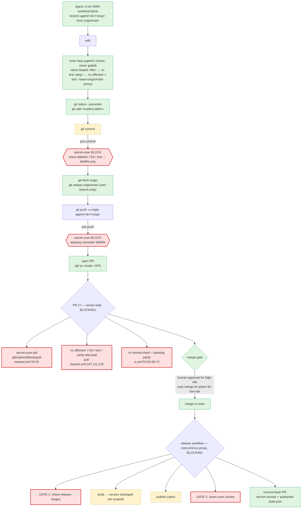

# Push/PR-First Integration Architecture — migration design

**Status:** DRAFT — design only. Nothing here is implemented. Requires human approval before any edit.
**Author:** architect agent (deepseek-v4-flash) · **Date:** 2026-09-18
**Repo:** `/Users/nix/dev/node/adhd` — Nx 18.3.4, pnpm 8.15.9, ~35 concurrent sibling worktrees, `core.hooksPath=.githooks`.
**Read-only engagement.** No file modified except this document. No build, test, `nx`, publish, or **mutating git command** was executed. Every claim is either **read from a file** (cited) or **reasoned from git/GitHub's documented model** and labelled `[reasoned]`. Unverified claims are labelled `(unverified)`.

**Reconciles with:**
- [`../worktree-workflow-redesign/WORKFLOW-REDESIGN.md`](../worktree-workflow-redesign/WORKFLOW-REDESIGN.md) — the ≤20-min budget, shared Nx cache, serialized publisher.
- [`../agent-git-safety/GIT-SAFETY-DESIGN.md`](../agent-git-safety/GIT-SAFETY-DESIGN.md) — C1/C2/C3, gate-placement principle, recovery.
- [`../nx-23-upgrade/UPGRADE-PLAN.md`](../nx-23-upgrade/UPGRADE-PLAN.md) — config-repair-first, hook ticket.

This design **adopts** the GIT-SAFETY principle verbatim and does not contradict any of the three. It changes one thing in WORKFLOW-REDESIGN: the serialization point for publish moves from a per-machine lock to the CI concurrency group (see §2.4).

---

## 0. Governance confirmation — no ADR catalog exists

`docs/decisions/**` returns **zero files** (glob, and independently confirmed at `UPGRADE-PLAN.md:100-105`). The `ADR-0007`/`ADR-0012`/`ADR-0015` references in `AGENTS.md:30` are **cross-repo citations from `sox-ecosystem`**, not decisions recorded here. **No locally-recorded ADR constrains this design.** The de-facto decisions encoded in `AGENTS.md` do, and this design honours them (no `--skip-nx-cache`, no direct `tsc`, pnpm only, worktrees under `.worktrees/`, no destructive git, ephemeral artifacts under `tmp/`/`.adhd/tmp/`, parallel-process-enabled as the invariant — ADR-0012).

**Recommendation (needs approval before writing):** create the catalog with `docs/decisions/0001-agent-integration-boundary.md` recording *this* decision (push/PR is the integration boundary; local gates are advisory except credential scanning). Draft on request; **write only after explicit approval.**

---

## 1. Target architecture — the agent's end-to-end flow

### 1.1 The flow



**Legend:** red = **blocking**; amber = **runs but does not block the local action**; green = no gate / agent action.

### 1.2 What the agent does locally

The exact allowed sequence (mirrors `GIT-SAFETY-DESIGN.md` §5, adapted to PR-first):

```sh
git fetch origin
git switch -c agent/<id>/<slug> origin/main
# … edit …
npx vitest related <changed-file>                 # micro
npx nx test <pkg>                                  # package
npx nx affected -t test --base=origin/main         # changed-set gate, ONCE
git status --porcelain
git add <explicit/path> [<explicit/path>…]         # explicit paths ONLY
git commit -m "<conventional message>"
git fetch origin && git rebase origin/main          # own branch only
git push -u origin agent/<id>/<slug>                # no --force
gh pr create --fill                                 # hand-off; DO NOT MERGE
```

### 1.3 What the agent must **never** do

Same hard bans as `GIT-SAFETY-DESIGN.md` §5 (table there), plus the two this migration adds:

| Banned | Why (this migration) |
|---|---|
| **`git merge` / local merges of `main`** | Under PR-first, integration is server-side. A local merge of `main` into a feature branch is a shared-ref operation the agent no longer needs; use `git rebase origin/main` on the agent's **own** branch. |
| **`git push --force` to any branch except the agent's own `agent/*`** | Shared-ref destruction (GIT-SAFETY vector #7/#20). `main` is server-protected (§3.3). |
| `git reset --hard`, `git clean -fd/-fdx`, whole-tree `git restore`/`checkout -- .` | destroys uncommitted work irrecoverably (C3) |
| `git stash`, `stash pop/clear/drop` | `refs/stash` is global across worktrees (vector #8) |
| `git update-ref` (any), `git branch -D/-f` on a branch you did not create | shared refs (vectors #5/#6) |
| `git gc --prune=now`, `git prune --expire=now`, `git reflog expire --expire=now --all` | destroys the recovery net (vectors #10/#11) |
| `git config core.*` / `core.hooksPath` / `gc.*`, any `git config --global` | shared/machine config (vectors #13/#14) |
| `git add -A`, `git add .`, `git commit -a` | sweeps another agent's in-flight work (vector #19) |
| `git tag -d` on a release tag | shared refs (vector #16) |

**Prerequisite (blocking):** `AGENTS.md:13` requires human approval to push. Push/PR-first is only possible if the operator grants **per-session blanket push permission** (the same shape as "continuous publish"). Without that grant, every push needs a human in the loop and the whole latency analysis in §4 collapses. **This is open question Q7.**

### 1.4 Where each gate lives, and blocking vs advisory

| Stage | Gate | Placement | Blocking? |
|---|---|---|---|
| local commit | secret-scan (staged) | `pre-commit` | **BLOCK** — see §3.2 |
| local commit | mass-deletion guard | `pre-commit` | **WARN** (was BLOCK) |
| local commit | affected lint | `pre-commit` | **WARN** (was BLOCK) |
| local commit | affected test | `pre-commit` | **WARN** (was BLOCK) |
| local commit (post) | mass-deletion warning | `post-commit` | never blocks (already so) |
| local push | secret-scan (push range) | `pre-push` (new) | **BLOCK** — see §3.2 |
| local push | affected lint/test reminder | `pre-push` (new) | **WARN** (message only, no run) |
| PR | secret-scan (range) | CI job | **BLOCK** |
| PR | affected lint / test / verify-dist-load | CI job | **BLOCK** |
| PR | format:check + backlog parity | CI job | **BLOCK** |
| merge | branch protection / required checks | GitHub settings | **BLOCK** |
| merge | merge-result affected test | merge queue (if adopted) | **BLOCK** |
| post-merge | release pipeline | `release.yml` | **BLOCK** |

### 1.5 Failure behaviour and what the message tells the agent

Every gate message must satisfy the GIT-SAFETY §3.4 contract — **assert the work is safe, name the fix, name the benign escape, forbid the destructive ones by name, print the recovery path.** The current messages (`pre-commit:129-133,152-154`) already model this for lint/test; the new ones must too.

**Local gate failure (advisory warn, `pre-commit`):**
```
⚠ pre-commit: affected test FAILED (advisory — your commit was created anyway).
  Your work is COMMITTED and SAFE. CI will enforce this on the PR.
  Fix it before you push:
      npx nx affected -t test --files="<staged>"
  Do NOT "clean up" — none of these are needed and they destroy work:
      ✖ git reset --hard   ✖ git clean -fd   ✖ git checkout -- .   ✖ git stash
  Recover (never reset): git reflog · git fsck --lost-found · git for-each-ref refs/backup/
```

**CI failure (PR, blocking):**
```
✖ PR CI: affected test FAILED. Your branch is PUSHED and SAFE — nothing is lost.
  Fix the cause, commit, and push again:
      npx nx affected -t test --base=origin/main
  Do NOT reset, clean, or stash to retry — none of them help a push and all destroy work.
  Detail: <check run URL>
```

**Secret detected (local pre-commit / pre-push, blocking):**
```
✖ secret-scan: a credential is staged. BLOCKED before it can reach the remote.
  Rotate it, remove it from the change, then commit/push again.
  (A leaked credential is unrecoverable — rotation, not reversion, is the fix.)
  Emergency bypass (benign to files): git commit --no-verify  /  git push --no-verify
```

### 1.6 May the agent merge?

**No.** The agent's deliverable is the **PR**, not the merge. Hand-off: the PR URL + a summary. Rationale: merge is a shared-ref mutation (vectors #5/#6/#7/#20); keeping it off the agent path removes that class entirely, and the server has no local destructive escape (GIT-SAFETY §3.3). Merge is performed by a **human** (high-risk) or **auto-merge-on-green** (low-risk) — see §7.

---

## 2. The release/publish path

### 2.1 What the workflow does **today** (read from the file, not assumed)

`.github/workflows/pull-request.yml`:

- **Trigger** (`:4-6`): `pull_request: types: [labeled, closed, opened, reopened, synchronize]`.
- **Publish guard** (`:129`):
  `if: success() && (contains(github.event.pull_request.labels.*.name, 'publish') || (github.event.action == 'closed' && github.event.pull_request.merged == true))`
  → publish runs **on the PR** when the `publish` label is applied, **or** when the PR is closed *and merged*. It is **not** a dry-run — it is a real publish.
- **What it runs** (`:130-141`):
  ```
  EXCLUDE=$(npx nx show projects --type=app …)
  AFFECTED=$(npx nx show projects --affected --exclude=$EXCLUDE …)
  npx nx affected -t build  --exclude=$EXCLUDE --parallel=4
  npx nx affected -t version --exclude=$EXCLUDE --parallel=4
  npx nx affected -t publish --exclude=$EXCLUDE --configuration=production --parallel=4
  ```
- **Credentials** (`:67`): job-level `NPM_TOKEN: ${{ secrets.NPM_TOKEN }}`. `PUBLISHING.md:436` states this must be an **automation** token (no OTP).
- **Ordering**: it runs *after* `Lint`, `Test`, `verify-dist-load` in the same job (`:105-125`), so `if: success()` makes those a de-facto pre-publish gate.
- **Secret-scan** is a separate job (`:15-61`), `if: github.event.action != 'closed'`, with `SECRET_SCAN_REQUIRE_GITLEAKS: '1'`.
- **Staleness**: `n1hility/cancel-previous-runs@v2` (`:82-84`) cancels superseded PR runs.
- **Checkout ref** (`:79`): `github.event.pull_request.head.sha` — CI publishes the **PR head**, i.e. code that has not necessarily been integrated into `main` yet.

**Two discrepancies to flag, not design around:**

1. `PUBLISHING.md:416-436` states the CI `Publish` step calls **legacy** `version`/`publish` targets whose production config hardcodes `npm publish dist/libs/core` (a non-existent path) and gets **none** of the `verify-dist-load` gating — filed as `BUG-CI-PUBLISH-STALE-TARGETS-001`. The plugin now defines `publish` with the real `@adhd/nx-build:publish` executor (`tools/nx-plugins/build/plugin.js:110`) and `nx-release-publish.dependsOn` includes `verify-dist-load` (`nx.json:159-168`). **Which target `nx affected -t publish --configuration=production` actually resolves to is `(unverified)`** — I cannot run `nx` to check, and there is no `production` configuration declared for the plugin's `publish` target. **This must be verified before moving publish to CI**, because if the legacy path is live, CI publish is already broken.
2. CI publish has **no commit-back step**: `version` bumps and `published-state.json` writes (`PUBLISHING.md:31-51,140-145`) are produced inside the CI checkout and **discarded** when the job ends. Every CI publish therefore re-pays the backfill and can re-bump.

### 2.2 Does publish move fully to CI?

**Recommendation: yes — and it moves from "on the PR" to "on merge-to-main."**

| | Today | Target |
|---|---|---|
| Trigger | PR `labeled:publish` **or** PR closed+merged | **merge to `main`** (a dedicated `release.yml`, `on: push: branches: [main]`) |
| Runner | the same `test` job (after lint/test/verify) | dedicated job, `concurrency: { group: release, cancel-in-progress: false }` |
| Command | `nx affected -t build/version/publish --configuration=production` | **`run-release.mjs`** — the real pipeline: `computeChangedProjectSet` → scoped build → explicit `version` → **GATE 1** → scoped `publish` → **GATE 2** |
| Credentials | `secrets.NPM_TOKEN` (automation token) | same |
| Write-back | none | commit-back **PR** of bumps + `published-state.json` (never a direct push to `main`) |

**Why merge-to-main, not the PR:** publishing from a PR head makes the **npm registry** the integration point instead of `main` — the exact opposite of push/PR-first. It also publishes code that a later merge/rebase may change. Merge-to-main makes `main` the single integration boundary; the release is a consequence of integration, not a parallel path.

**Why `run-release.mjs` and not raw `nx affected -t publish`:** the raw invocation bypasses `changed-set.js` scoping (`PUBLISHING.md:386-392`), GATE 1, and GATE 2. `run-release.mjs` is the audited pipeline that closes the three real 2026-07-31 failures (`run-release.mjs:1-160`).

### 2.3 What breaks when publish leaves the local path

| Thing | What happens | Fix |
|---|---|---|
| **npm credentials** | local `npm login` (2FA/OTP) is unavailable in CI; CI needs the **automation token**. | `secrets.NPM_TOKEN` already exists; confirm it is an automation token (`PUBLISHING.md:436`). |
| **`published-state.json`** | written in CI, **not committed** → discarded. Next run re-backfills; version decisions drift. | commit-back PR of `published-state.json` + bumped `package.json`; or treat it as a regenerable cache refreshed by `nx run-many -t reconcile` in CI. |
| **`release-reset` / `version` executors read live git state** | `version` reads `publishedFromRef` from `published-state.json`, falling back to `HEAD~1` (`PUBLISHING.md:326-355`). On a **merge commit**, `HEAD~1` is one parent — wrong base → empty changed-set → **exit 0 having published nothing**. | set `RELEASE_BASE_REF` explicitly in CI (previous main tip / last release commit), or rely on `publishedFromRef` being present. Add a CI assertion that the computed scope is non-empty when the merge touched publishable projects. |
| **GATE 2 clean-room smoke** | `npm install <name>@latest` from the real registry — works in CI (network), adds ~45 s–2 min. | keep; it is the only end-to-end installability proof. |
| **`sync-global` (step 3.5)** | flips the **operator's** global CLI shims on the operator's machine. In CI there is no operator machine → meaningless, and its non-zero exit **fails the whole release** (`run-release.mjs` RESULT (d)). | **`run-release.mjs` needs a CI mode that skips `sync-global`** (or the CI entrypoint must not require it). Without this, every CI release exits non-zero. **This is the single most concrete break.** |
| **Local lock `~/.adhd/release.lock`** | per-machine, never coordinates with CI. | superseded by the CI concurrency group (§2.4). |

### 2.4 Serialization — which point wins

`WORKFLOW-REDESIGN.md` §4.2 designed `~/.adhd/release.lock` (via `tools/nx-plugins/lib/file-lock.js`, which exists — `file-lock.js:39-67`) to serialize **~35 local worktrees each running `pnpm release`**. Under PR-first + CI publish, **those 35 local publishers no longer exist** — the local release is retired for routine use. The new serialization point is the **GitHub Actions `concurrency` group** on `release.yml`.

**Verdict: the CI concurrency group wins as the cross-run serialization point; `WORKFLOW-REDESIGN`'s topological-publish design is retained *inside* the CI run.** Concretely:

- `concurrency: { group: release, cancel-in-progress: false }` guarantees at most one release run at a time (mirrors the lock's "held for the whole publish run").
- Inside that run, the stage-2 publisher (drop `^publish`, order topologically — `WORKFLOW-REDESIGN` §4.2) still applies; the registry immutability + `isAlreadyPublishedError` + semver-directional guard remain belt-and-braces.
- Keep the local `~/.adhd/release.lock` **only** for the discouraged manual local publish path. It is no longer the primary serialization point, and `release.lock` does **not exist yet** (grep: no `release.lock` / `acquireLock` in `run-release.mjs`) — so nothing to remove, only something not to build.
- **Residual:** CI and a human running `pnpm release` locally can still race across the boundary. The registry's immutability is the only cross-boundary guard. Mitigation: **ban routine local publish**; if a local emergency publish is needed, it is a human action with the local lock held.

---

## 3. Local-gate policy — keep / relax / delete

**Guiding principle (from `GIT-SAFETY-DESIGN.md` §3.3, adopted verbatim):**
> *Never place a blocking gate where the cheapest escape is destructive. Put hard enforcement as late and as far from the working tree as possible (CI / server-side). Locally, prefer a non-blocking warn plus a benign, single-flag bypass that is cheaper than any destructive command. A gate whose failure message names a cleanup command is a bug.*

### 3.1 The decision table

| Hook | Gate | Verdict | Justification |
|---|---|---|---|
| `pre-commit` | **Gate 0** mass-deletion guard (`pre-commit:57-64`) | **RELAX → WARN** | Blocking at `pre-commit` is the **worst placement**: work is not durable, "clean the tree" is the obvious wrong fix, and `reset`/`clean`/`stash` are the cleanup verbs. Its failure message currently names no destructive command, but the *situation* manufactures the reach. Hard enforcement moves to **CI** (run the same `detect-mass-deletion.js --range` classifier on the PR range) — `post-commit:47-63` already warns non-blockingly and survives `--no-verify`. |
| `pre-commit` | **Gate 1** secret-scan (`pre-commit:79-83`) | **KEEP BLOCKING** | The one gate whose **escape is benign**: the natural fix is "remove/rotate the secret," and the bypass (`git commit --no-verify`) is **file-safe**. The cost of a miss is unrecoverable (rotation, not reversion), so the asymmetry justifies blocking. Cheap (pattern rules + gitleaks). Assessed on its merits in §3.2. |
| `pre-commit` | **Gate 2** affected lint (`pre-commit:105-135`) | **RELAX → WARN** | Redundant with CI (`ci.yml:54`, `pull-request.yml:107`). Carries a **mutation hazard** — `lint.dependsOn: ["sync-deps"]` (`nx.json:169-171`) rewrites tracked `package.json`, which the hook then fails the commit for (`pre-commit:110-124`). The blocked agent's cheapest perceived escape is a cleanup. WARN keeps the fast signal, drops the block. |
| `pre-commit` | **Gate 3** affected test (`pre-commit:146-156`) | **RELAX → WARN** | The expensive gate (measured p90 **275 s**, max 603 s — `WORKFLOW-REDESIGN.md:24`), the main driver of the 15.8% blocked rate, and the one that pushes agents onto the broad path. It is already enforced at CI. Blocking here is pure destructive-escape pressure with no coverage CI lacks. |
| `post-commit` | mass-deletion warning (`post-commit:47-63`) | **KEEP AS-IS** | Already non-blocking, already survives `--no-verify`, already the one local seam. **Extend** (separate phase) with a `refs/backup/auto/<branch>/<ts>` snapshot (`GIT-SAFETY` §4.3). |
| `.githooks/pre-merge-commit` (proposed, branch `fix/merge-gate-hook`) | merge-result affected test | **DELETE** | Under PR-first, **local merges disappear** — GitHub merges server-side, where no local hook fires. The gate's one genuine value (a semantic conflict that neither side tested) is exactly what a **merge queue** does better server-side. Keeping it is dead code that adds a local `git reset --keep ORIG_HEAD` revert path (`post-merge:50`). |
| `.githooks/post-merge` (proposed, branch) | ff test + revert | **DELETE** | Same reason. Its `git reset --keep ORIG_HEAD` is non-destructive (correctly chosen over `--hard`), but it is a local revert command the PR-first flow no longer needs. |
| `.githooks/pre-push` (new) | **secret-scan (push range)** | **ADD — BLOCKING** | The **last local seam before the remote** and the only local gate that also catches a `--no-verify` commit. Benign escape (`git push --no-verify`), cheap, unrecoverable-on-miss. This is the correct home for the "must block locally" credential gate. |
| `.githooks/pre-push` (new) | affected lint/test | **DO NOT ADD** | CI is the boundary; adding a blocking or even running pre-push test adds push latency (p90 275 s) for zero coverage. At most, print a reminder. |
| `.claude/hooks/check-nx-scope.sh` (PreToolUse) | nx-scope denial | **RELAX** per `WORKFLOW-REDESIGN` §4.6 | Measured: 575/3,631 (15.8%) blocked, pushed agents onto the p90-275 s broad path. Allow targeted `nx test/build`; keep the hard block on unscoped `run-many -t publish`; reword the deny to `--files=<path>`. |

### 3.2 The secret-scan exception, assessed on its merits

The operator's hypothesis is that secret-scanning is the one gate that genuinely must block locally. **It is correct, and here is why the usual argument against local blocking does not apply:**

1. **The failure's natural remedy is non-destructive.** A blocked commit/push with a detected credential does not invite "clean the tree" — the detected secret is *in the change*, so the fix is to remove/rotate it. The gate's message (`pre-commit:81-82`; new draft in §1.5) names removal/rotation, never a cleanup command.
2. **The bypass is file-safe.** `git commit --no-verify` / `git push --no-verify` skip the gate without touching files — a one-flag escape that is *cheaper* than any destructive command, satisfying the "make the safe path cheapest" rule.
3. **The cost asymmetry is extreme.** A leaked credential is unrecoverable once pushed (rotation, not reversion); a lint/test miss is trivially recoverable. The gate's value is highest exactly where the escape is benign.
4. **It is already cheap and dual-engined** (pattern rules + gitleaks, `.githooks/README.md:117-147`), so the latency cost of blocking is near zero.

**Placement:** keep it at `pre-commit` (fast fail, before history) **and add it at `pre-push`** (catches `--no-verify` commits; the last local seam before the remote). Both blocking, both cheap, both benign-escape. **This is the only gate that should block locally.**

### 3.3 Server-side (the real enforcement boundary)

| Control | Where | Why |
|---|---|---|
| Required status checks (`secret-scan`, `test`, `lint`, `verify-dist-load`, `format:check`) | GitHub branch protection on `main` | un-bypassable by a local agent; no local destructive escape |
| Require PR, dismiss stale approvals, no direct push to `main` | branch protection | makes `main` the integration boundary |
| No force-push to `main` / protect `main` | branch protection | closes vector #7/#20 at the remote |
| Mass-deletion classifier on the PR range | new CI job (reuse `detect-mass-deletion.js --range`) | the hard form of the relaxed Gate 0 |
| Merge-result affected test | **merge queue** (if adopted) or post-merge CI | the hard form of the deleted merge gate |

**Note:** branch protection is a GitHub-settings change, not a repo file — it needs the operator (§7, Q5). No `.github/CODEOWNERS` exists today.

---

## 4. The latency tension — addressed honestly

### 4.1 What the PR round-trip adds

`WORKFLOW-REDESIGN.md` §3.2 modelled the **local** change→published path at **~8 min** for `backlog` (warm shared cache) and **~1 min** for a small package. The PR round-trip adds four serial costs the local model does not include:

1. **Push + PR creation:** seconds.
2. **CI queue:** GitHub-hosted `ubuntu-latest`, 0–3 min under contention (35 worktrees pushing); `cancel-previous-runs` (`pull-request.yml:82-84`) cancels superseded runs but each new push restarts the clock.
3. **CI run, COLD:** this is the decisive cost. CI sets `NX_NO_CLOUD: true` (`ci.yml:17`, `pull-request.yml:68`) and has **no shared `.nx/cache`** — the `~/.adhd/nx-cache` symlink from `WORKFLOW-REDESIGN` §4.4 is a local filesystem path CI cannot see. So every CI `nx affected` runs cold, and the whole affected closure re-executes on every push. Measured cold rate ~2.6 s/test task (`WORKFLOW-REDESIGN.md:607`):
   - small package (18 affected tasks): ~1 min
   - `backlog` (21 tasks, incl. the measured **339 s** e2e suite): ~6 min
   - foundation package (218 affected tasks — `workspace-base-vite-paths`, `WORKFLOW-REDESIGN.md:81`): **~9.5 min**
   Plus `pnpm install` cold (~1–2 min) + `secret-scan` job on a separate runner (~2 min, parallel).
4. **Publish (if it moves to CI):** a **second** cold job after merge — scoped build + version + publish + GATE 2. For a heavy closure, ~10–20 min cold.

### 4.2 Verdict against the ≤20-minute target

**Do not silently drop the target. State the split honestly:**

| Package class | Local (redesigned) | + PR CI (cold) | + CI publish (cold) | E2E | ≤20? |
|---|---:|---:|---:|---:|---|
| small (`data-base-transforms`) | ~1 min | ~3–6 min | ~5–8 min | **~9–15 min** | ✅ (tight) |
| heavy (`backlog`) | ~8 min | ~8–12 min | ~10–20 min | **~26–40 min** | ❌ |
| foundation (high fan-out) | ~3 min | ~10–14 min | ~8–15 min | **~21–32 min** | ❌ |

**Honest achievable numbers:**
- **With a remote Nx cache (Nx Cloud or self-hosted), CI runs warm:** CI cost drops to ~1–3 min for every class; heavy/foundation land at **~12–18 min**. **≤20 min is achievable for all classes.**
- **Without a remote cache (today's `NX_NO_CLOUD: true`):** small packages meet ≤20; **`backlog` and foundation packages have a floor of ~25–35 min.** The earlier ≤20-min target holds only for small/medium packages. The achievable number for the heavy class is **~30 min**, and it improves to ~15 min the day the remote cache lands.

**The single decisive lever is the remote Nx cache, not the PR flow.** The PR flow is cheap (~3–6 min warm); it is the **cold CI** that breaks the budget. This must be said plainly: push/PR-first is compatible with ≤20 min *if and only if* CI is warm.

### 4.3 Mitigations — which are feasible here

| Mitigation | Feasible? | Effect | Cost |
|---|---|---|---|
| **Remote Nx cache** (Nx Cloud / self-hosted) | **Yes — the decisive one** | removes the cold-run penalty entirely; CI drops to ~1–3 min | cost/infra + cache-poisoning/secret-leak review; requires flipping `NX_NO_CLOUD` |
| **Fast affected-scoped CI** | **Already done** (`nx affected` everywhere) | keeps the closure minimal | none |
| **Merge queue** | **Yes** (needs `merge_group` trigger in workflows + GitHub settings) | catches merge-result breakage server-side (replaces the deleted local merge gate); serializes the merge | adds one serialized CI run; no `merge_group` trigger exists today |
| **Auto-merge-on-green** | **Yes** (GitHub auto-merge + branch protection) | removes human latency from low-risk merges | needs branch protection (Q5) |
| **Rebase-on-stale automation** | **Yes** (bot / `update-branch` API) | keeps PRs current against a fast-moving `main` | each rebase re-runs CI — cheap with a remote cache, costly without |
| **Batching** | **Yes** (already the norm — one PR per logical change) | amortizes queue+CI over more packages | none |

**Recommendation:** adopt the remote cache **first** (it is the budget), then merge queue + auto-merge. Without the remote cache, the merge queue and rebase automation *increase* cost (more cold CI runs), so do not adopt them before the cache.

---

## 5. What this migration does NOT fix

### 5.1 C3 — uncommitted work in a shared working tree is unrecoverable

**Push/PR does not help.** C3 is about content that was never committed; it is not in the object store, so no ref/reflog can recover it, and it is *before* the push. The counterexample (`GIT-SAFETY-DESIGN.md` §0): two agents in the same working tree; one runs `git reset --hard` or the other's `git clean -fd` wipes the first's edits instantly.

**Minimal additional control:** **one agent per working tree; the main checkout is human-only.** This is the only thing that closes C3.

**In scope?** The **operational rule** is in scope for this migration (§6 Phase 5) — it is a policy + harness-deny change, cheap and independently landable. The **structural mechanism** (per-agent `git clone` instead of shared-`.git` worktree, `GIT-SAFETY` §4.1) is a **separate migration** (it changes worktree allocation across ~35 existing worktrees and needs the shared Nx cache first).

### 5.2 `refs/stash` is global across worktrees

**Push/PR does not help.** `refs/stash` is one shared ref for the whole repo (`.git/packed-refs:61`); `git stash pop` in worktree B applies worktree A's stash to B's tree; `git stash clear` drops **every** agent's stash at once (`GIT-SAFETY` vector #8). The `AGENTS.md` ban is **prose-only**: `.claude/settings.json` has **no `deny` block** — verified, `:2-27` is `allow`-only and `:28-42` is the single PreToolUse nx hook.

**Minimal additional control:** add a harness `permissions.deny` block for the literal destructive verbs:
```
Bash(git reset --hard:*)      Bash(git clean -f*)
Bash(git stash:*)             Bash(git checkout -- .*)
Bash(git update-ref:*)        Bash(git branch -D:*)
Bash(git config core.hooksPath:*)  Bash(git gc --prune=now:*)
Bash(git reflog expire:*)
```
Honest limit (`GIT-SAFETY` §4.2): string-matched, obfuscatable, friction not proof.

**In scope?** **Yes** — it is a small, config-only, independently-landable change (§6 Phase 5). Do not oversell it as a guarantee.

### 5.3 Shared-ref destruction

**Push/PR helps only partially.** Server-side branch protection closes `push --force` to `main` (vector #7). It does **not** close `update-ref -d`, `branch -D/-f`, `tag -d`, or `config core.hooksPath` from any local worktree (vectors #5/#6/#13/#16) — those are local shared-`.git` operations that never touch the remote.

**Minimal additional controls:**
1. The same `permissions.deny` block (§5.2) covers `update-ref`, `branch -D`, `tag -d`, `config core.hooksPath`.
2. Server-side: branch protection (no force-push, require PR) — an operator/GitHub-settings action.
3. Optional recovery net: `refs/backup/*` namespace + `post-commit` auto-snapshot (`GIT-SAFETY` §4.3) — converts permanent loss into recovery for committed work.

**In scope?** The deny block **yes**; branch protection **yes (operator action)**; `refs/backup/*` **separate** (it is a recovery feature, not an integration-boundary change).

---

## 6. Migration path — phased, reversible, independently landable

| Phase | What changes | Verification gate | Rollback | Risk |
|---|---|---|---|---|
| **0 — Record the decision** | Add `docs/decisions/0001-agent-integration-boundary.md` (proposed; write only after approval). Record the target flow + one-agent-per-working-tree rule. | Doc reviewed & approved by operator. | Delete the file. | None. |
| **1 — Relax local commit gates** | `.githooks/pre-commit`: mass-deletion / lint / test → **WARN** (print, `exit 0`); secret-scan stays **BLOCK**. | A deliberately-failing staged test does **not** block a commit but prints the warn; a staged fake secret **does** block; `--no-verify` still works. | `git restore .githooks/pre-commit`. | A broken change reaches the branch — caught by CI. Low. |
| **2 — Add `pre-push`** | New `.githooks/pre-push`: secret-scan on the push range **BLOCK**; advisory reminder only (no test run). | Push with a credential is blocked; push with a failing affected test succeeds with a warn. | Delete the file. | Push latency ≈0 (scan is cheap). Low. |
| **3 — CI becomes the boundary** | Add branch protection (require PR + checks, no direct push, no force-push); add `merge_group` trigger + a merge-queue-compatible job. | Direct push to `main` rejected; a PR with a red check cannot merge; a `merge_group` run executes. | Relax branch protection (GitHub settings). | Locks out the emergency path — document a break-glass admin override. Medium (operator action). |
| **4 — Publish to CI on merge-to-main** | Add `release.yml` (`on: push: main`, `concurrency: group: release`), invoking `run-release.mjs` in a **CI mode that skips `sync-global`** and sets `RELEASE_BASE_REF`; commit-back via **PR** of bumps + `published-state.json`. Retire the `publish`-label path. | A merge to `main` publishes exactly the changed packages; `published-state.json` lands via a PR; GATE 2 passes; a no-op merge publishes nothing. | Disable `release.yml`; revert to local `pnpm release`. | Credentials; commit-back loop (guard with `[skip ci]` / bot-identity check); merge-commit base-ref (set `RELEASE_BASE_REF`). Medium. |
| **5 — One-agent-per-working-tree + harness deny** | Add `permissions.deny` block (§5.2); adopt the operational rule. | A denied `git stash` is refused by the harness; two agents never share a working tree. | Remove the deny block. | Deny is obfuscatable — friction only. Low. |
| **6 — Delete merge-gate hooks; relax nx hook** | Delete the proposed `pre-merge-commit`/`post-merge`; relax `.claude/hooks/check-nx-scope.sh` per `WORKFLOW-REDESIGN` §4.6. | Targeted `nx test <pkg>` allowed; unscoped `run-many -t publish` still blocked; no local merge gate (CI/merge-queue covers). | Restore the files. | Loss of local merge coverage — compensated by Phase 3's merge queue. Low. |
| **7 — Remote Nx cache** | Enable Nx Cloud / self-hosted remote cache; remove `NX_NO_CLOUD: true` from `ci.yml:17` and `pull-request.yml:68`. | A second CI run restores affected tasks from the remote cache (measurable cache-hit ratio). | Re-enable `NX_NO_CLOUD`. | Cache poisoning / secret leakage — needs review. **This is the phase that makes ≤20 min true for heavy packages.** |

**Sequencing:** Phases 1–2 and 5–6 are cheap, local, and independently landable now. Phase 3 is the operator's branch-protection action. Phase 4 depends on verifying the CI `publish` target resolution (§2.1 discrepancy #1). Phase 7 is the latency lever and should be scheduled **before** Phase 3's merge queue (the queue multiplies cold runs).

---

## 7. Open questions for the operator (with recommendations)

| # | Question | Recommendation |
|---|---|---|
| **Q1** | **Who merges PRs** — human, auto-merge-on-green, or both? | **Both.** Auto-merge-on-green for low-risk (docs, tests, leaf packages with no dependents); **human approval** for foundation packages (high fan-out), publishable packages, security-sensitive paths, and `.githooks/`/`.github/`/`nx.json`. |
| **Q2** | **Does publish move fully to CI?** | **Yes** — on **merge-to-main** via a dedicated `release.yml` using the real `run-release.mjs` pipeline, with a CI mode that skips `sync-global`, and version bumps + `published-state.json` written back via an automated **PR** (never a direct push to `main`). Retire the `publish`-label path. |
| **Q3** | **Do local gates relax or go?** | **Relax, don't delete.** mass-deletion/lint/test → **WARN**; **secret-scan stays BLOCK** (at `pre-commit` and the new `pre-push`). The local fast-feedback is worth keeping; only the *block* moves server-side. |
| **Q4** | **Is one-agent-per-working-tree adopted?** | **Yes, as a hard operational rule now** (it is the only thing that closes C3), plus the harness `permissions.deny` block. Per-agent **clones** (`GIT-SAFETY` §4.1) are a **separate** later migration, after the shared Nx cache. |
| **Q5** | **Adopt branch protection + merge queue?** | **Yes** — branch protection is required to make CI the real boundary; the merge queue is the server-side replacement for the deleted local merge gate. Both are GitHub-settings/operator actions. |
| **Q6** | **Enable a remote Nx cache?** | **Yes — it is the prerequisite for ≤20 min on heavy/foundation packages.** Without it, the honest floor is ~30 min for `backlog`/foundation. |
| **Q7** | **Grant agents per-session blanket push permission?** | **Yes** — `AGENTS.md:13` requires human approval to push; push/PR-first is impossible without a per-session grant (the same shape as "continuous publish"). Without it, every push re-introduces human latency and §4's numbers are moot. |

---

## 8. Measured vs reasoned — honesty section

**Read from the repo (verified, cited):** `docs/decisions/` absent (glob + `UPGRADE-PLAN.md:100-105`); the full `pull-request.yml` publish trigger/guard/command/credentials; `ci.yml` triggers and `NX_NO_CLOUD`; `.githooks/pre-commit` gate order and line numbers; `.githooks/post-commit` non-blocking behaviour; the `fix/merge-gate-hook` worktree's `pre-merge-commit`/`post-merge`/`merge-gate.js` and its `post-merge` `git reset --keep ORIG_HEAD`; `.claude/settings.json` allow-only + single PreToolUse hook (**no `deny`**); `nx.json` targetDefaults (`test.dependsOn:["lint","^build"]`, `lint.dependsOn:["sync-deps"]`) and `release` block; `tools/nx-plugins/build/plugin.js:110` publish `dependsOn`; `run-release.mjs` pipeline; `package.json:10` `release` script and `:6` `prepare`; `PUBLISHING.md` CI-publish warning and `published-state.json` design; `file-lock.js` exists; **`release.lock` does NOT exist**; `.worktrees/` contents; no in-repo CODEOWNERS.

**Reasoned from git/GitHub's documented model, not executed `[reasoned]`:** that GitHub merges do not run local hooks; branch-protection/merge-queue semantics; CI `ubuntu-latest` queue and cold-cache behaviour; that `nx affected -t publish --configuration=production` resolves to the plugin target vs the legacy path (flagged `(unverified)`).

**Not verified `(unverified)`, not relied on for the design:** whether the CI `publish` step currently resolves to the real `@adhd/nx-build:publish` executor or the legacy `npm publish dist/libs/core` path (`PUBLISHING.md:416-436` vs `plugin.js:110`); the CI queue/run wall-clock on this repo's actual GitHub runner (the §4 numbers are models built from `WORKFLOW-REDESIGN`'s measured rates, not CI measurements); whether `secrets.NPM_TOKEN` is an automation token.

**Tooling note:** GitNexus MCP tools were **not available** in this agent's toolset; analysis was done by direct file reads (the path-B fallback). `tools/nx-plugins/**` is reportedly not indexed — I could not confirm or refute this via `gx`. No mutating git command was run; no build, test, `nx`, or publish was executed.

**What would change the answer:** a CI measurement of one real PR run (queue + cold affected test + secret-scan) and one real release run; confirmation of the CI `publish` target resolution; and whether a remote Nx cache is adopted (which moves the heavy-class verdict from ~30 min to ~12–18 min).
