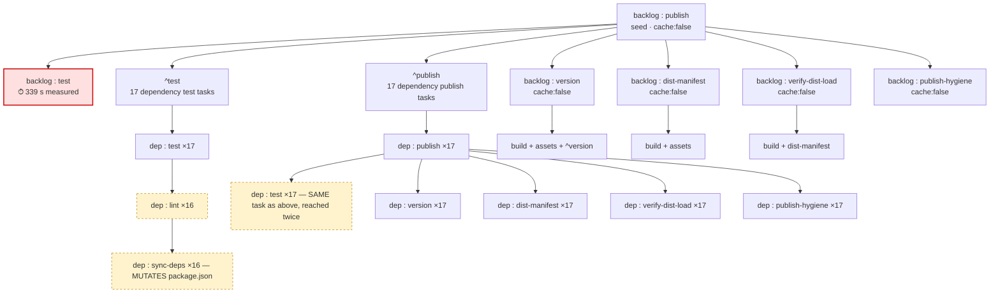
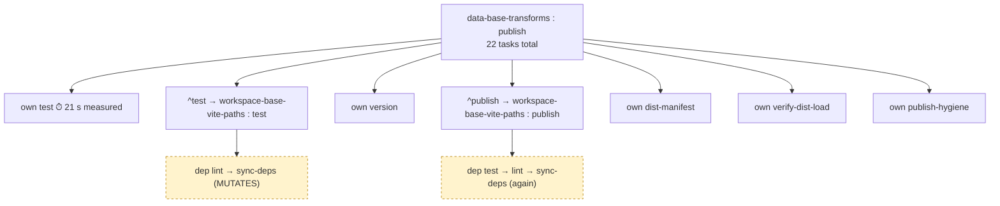
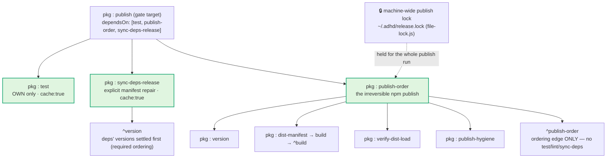

# Worktree Workflow Redesign — change → validated → published in ≤20 minutes

**Status:** DRAFT — design only. Nothing here is implemented. Requires human approval before any edit.
**Author:** architect agent (deepseek-v4-flash) · **Date:** 2026-09-18
**Repo:** `/Users/nix/dev/node/adhd` — Nx **18.3.4**, pnpm 8.15.9, ~63 projects, ~35 concurrent sibling worktrees.
**Supersedes nothing.** Reconciles with [`../nx-23-upgrade/UPGRADE-PLAN.md`](../nx-23-upgrade/UPGRADE-PLAN.md) (§8).

> **Method.** All task counts below are computed with Nx's own
> `createTaskGraph()` + `mapTargetDefaultsToDependencies()` (the orchestrator's exact code path) —
> **pure graph math, no task execution**. No build, test, `nx reset`, or publish was run; no
> worktree or tree file was modified. Per-package warm/cold wall figures are taken from the
> measured `CFGFIX-VALIDATION.md` runs and the prior session measurements named in the brief.
> Every number is tagged **[M]** measured, **[D]** derived from a measured rate, or **[E]**
> extrapolated/modelled. See §6.

---

## 0. The verdict up front

**≤20 minutes is achievable for every package class — but only after four changes, and only warm
(shared cache).** The single release is not the main problem; the *agent inner loop* is. Measured,
`nx affected` is **75% of all nx time (23.0 h of ~30.6 h)** and the dominant loop is
`edit → nx affected → repeat` (**976 `affected→affected` transitions**), median **36 s**, p90
**275 s**, max **603 s** [M]. A worktree that iterates three times on a heavy package pays ~14 min
*in the loop alone* before the release even starts.

| package class | representative | current E2E (modelled) | redesigned E2E (modelled) | ≤20 min? |
|---|---|---:|---:|---|
| small | `data-base-transforms` | ~5–6 min [E] | **~1 min** [E] | ✅ large headroom |
| heavy | `backlog` | **~26 min** [E] | **~8 min** [E] | ✅ ~12 min headroom |
| foundation (high fan-out) | `workspace-base-vite-paths` | ~30–50 min [E] | **~3 min** [E] | ✅ fan-out does **not** affect publish |

**The one correction that matters most:** dropping `^test` from `publish.dependsOn` — the fix the
upgrade plan ranks as A6 with a claimed `204 → ~22` win — is **provably a complete no-op**
(`204 → 204`, `22 → 22`; verified with `createTaskGraph`). `^publish` already induces every
dependency's `publish → test → lint → sync-deps`. The real cut is removing `lint` from
`test.dependsOn` and from `build`/`@nx/js:tsc` `dependsOn` (the three cfgfix fixes), which is
`204 → 172` for `backlog`'s publish closure and `234 → 120` all-suite. See §8.

**Biggest single cost eliminator:** removing `lint` + `sync-deps` from the `test` and `build`
dependency closures — **−94 tasks / −40.2% all-suite (234→140), −48.7% in the cfgfix measurement
(234→120)**, plus it stops `nx test` from mutating tracked `package.json`. The biggest *wall-clock*
eliminator is fixing the inner loop + the PreToolUse hook, because that is where 75% of measured
nx time goes.

---

## 1. "Current" — what is actually executed today

### 1.1 Publish closure — `backlog` (the heavy case): **204 tasks**

The `publish` target is attached to every publishable project by
`tools/nx-plugins/build/plugin.js:110`:

```js
"publish": {
  "executor": "@adhd/nx-build:publish",
  "dependsOn": ["test", "^test", "version", "^publish", "dist-manifest", "verify-dist-load", "publish-hygiene"],
  "cache": false
}
```

`^test` and `^publish` both fan out across the transitive dependency closure. `^publish` is
load-bearing (BUG-002: it orders publish topologically so a dependent never lands before the
`@adhd/*` dependency it declares — the ETARGET window). But it **also** transitively pulls every
dependency's `test`, and `test.dependsOn = ["lint", "^build"]` pulls `lint → sync-deps`, which
**rewrites `package.json`**.



**Closure breakdown (exact, `createTaskGraph`)** — `backlog` publish, current config:

| target | tasks | note |
|---|---:|---|
| `build` | 28 | dependency builds (`^build`) |
| `test` | 18 | own (339 s [M]) + 17 dependency tests |
| `lint` | 16 | **only reachable via `test.dependsOn`** |
| `sync-deps` | 16 | **only reachable via `lint.dependsOn`; mutates tracked files** |
| `version` | 18 | `cache:false`; reads `published-state.json` |
| `dist-manifest` | 18 | `cache:false` |
| `verify-dist-load` | 18 | `cache:false` |
| `publish-hygiene` | 18 | `cache:false` |
| `publish` | 18 | own + 17 dependency publish tasks (mostly no-op at runtime) |
| `assets` / `chmod-bin` | 18 / 18 | dist doc-completeness |
| **total** | **204** | |

Distinct projects in the closure: **28**. So publishing one package schedules release tasks for
**28 packages**, of which 27 are already published and will no-op — but their `test`, `lint`,
`sync-deps`, `version`, `dist-manifest`, `verify-dist-load`, `publish-hygiene` tasks still execute.

### 1.2 Publish closure — `data-base-transforms` (the leaf-ish case): **22 tasks**



Breakdown: `publish` 2, `test` 2, `lint` 2, `sync-deps` 2, `build` 2, `version` 2, `assets` 2,
`dist-manifest` 2, `verify-dist-load` 2, `publish-hygiene` 2, `chmod-bin` 2. **8 of 22 tasks
(36%) are `lint`+`sync-deps`** — pure overhead. `data-base-transforms` is already near-cheap; the
contrast with `backlog` (204 tasks) is the whole point: **cost is driven by the dependency-closure
size, not by the changed package.**

### 1.3 Affected-test closure (the inner-loop command agents actually run)

| package | affected projects | affected `test` tasks (current) | breakdown |
|---|---:|---:|---|
| `data-base-transforms` | 4 | **18** | 4 test + 4 lint + 4 sync-deps + 3 build + 1 assets + 1 chmod-bin + 1 dist-manifest |
| `backlog` | 1 | **21** | 1 test (339 s) + 18 build + 1 assets + 1 chmod-bin |

`backlog`'s 339 s is **genuine test work** (~30 spec files incl. `server.mcp.spec.ts`,
`install.e2e.spec.ts`, `rag-e2e.spec.ts`) — not over-declaration. It is the single heaviest task in
the entire workflow and the reason the inner loop blows the budget for that package.

### 1.4 Timeline — where the wall-clock actually goes (current)

`backlog`, one worktree change → publish, modelled at measured p90 rates [D/E]:

```mermaid
gantt
  title Current: backlog worktree change → published (p90 rates, no shared cache)
  dateFormat X
  axisFormat %ss
  section setup
    pnpm install (no hash gate) + nx daemon :a1, 25s
  section inner loop — edit then nx affected -t test
    affected #1 (p90 275 s) :a2, 275s
    affected #2 :a3, 275s
    affected #3 :a4, 275s
  section lint gate (separate, ~92% duplicated)
    nx affected -t lint :a5, 60s
  section release — pnpm release
    build 28 tasks (cold, own worktree cache) :a6, 47s
    17 dependency tests (via ^test and ^publish) :a7, 90s
    backlog:test 339 s measured :crit, a8, 339s
    version+manifest+verify+hygiene for 18 pkgs (cache:false) :a9, 120s
    npm publish 18 tasks :a10, 25s
    GATE 2 clean-room smoke :a11, 45s
```

Total ≈ **26.3 min** [E] — outside budget, dominated by the three inner-loop `affected` runs
(13.75 min) and the uncached release fan-out.

`data-base-transforms`, same shape:

```mermaid
gantt
  title Current: data-base-transforms worktree change → published
  dateFormat X
  axisFormat %ss
  section setup
    pnpm install + nx start :b1, 25s
  section inner loop
    affected #1 (18 tasks, incl. 3 dependents) :b2, 58s
    affected #2 :b3, 58s
    affected #3 :b4, 58s
  section release
    build 2 tasks :b5, 4s
    test 2 tasks (own 21 s) :crit, b6, 21s
    version+manifest+verify+hygiene ×2 (cache:false) :b7, 16s
    npm publish ×2 :b8, 8s
```

Total ≈ **4.6 min** [E]. The leaf case is *already* close — the redesign's value there is the
eliminated `lint`/`sync-deps` and the shared cache, not a rescue.

---

## 2. "Redesigned" — the proposed task set

### 2.1 Publish closure — `backlog`: **190 → 78 tasks** (two stages)

**Stage 1** (no new publisher yet): the cfgfix fixes (#1 drop `lint` from `test.dependsOn`,
#2 drop `lint` from `build`/`@nx/js:tsc` `dependsOn`) + #3 (delete the 9 `scripts.build`) +
#6 (`^test` removed, no-op but honest) + a declared `sync-deps-release` manifest repair.
**`204 → 190`.**

**Stage 2** (serialized publisher exists): drop `^publish` — ordering moves from task-graph edges
into the single publisher, which topologically sorts its queue. **`190 → 78`** (verified variant A:
`{"assets":18,"build":18,"chmod-bin":18,"version":18,"dist-manifest":1,"publish":1,"publish-hygiene":1,"release-manifest":1,"test":1,"verify-dist-load":1}`).



**What is eliminated and why:**

| eliminated | tasks (backlog) | why |
|---|---:|---|
| dependency `lint` + `sync-deps` in the test closure | −32 | a test never reads lint output; lint is already an independent CI/pre-commit gate |
| `^test` | 0 (no-op) | fully subsumed by `^publish`; removed for honesty, not for cost |
| `^publish`'s transitive dependency release fan-out | −112 (stage 2) | ordering is the publisher's job, not a task-graph edge; already-published deps need no release tasks at all |
| `+ sync-deps-release` (declared repair) | +18 | the *only* cost the redesign adds — and it is a correctness requirement, not overhead |

### 2.2 Publish closure — `data-base-transforms`: **20 → 14 tasks**

Stage 1: `22 → 20` (drops 2 lint + 2 sync-deps, adds 2 `sync-deps-release`).
Stage 2: `20 → 14` (drops `^publish`).

### 2.3 Affected-test closure (redesigned)

| package | affected `test` tasks current | redesigned | change |
|---|---:|---:|---|
| `data-base-transforms` | 18 | **10** | −8 (lint+sync-deps gone) |
| `backlog` | 21 | **21** | unchanged — its closure is `test + ^build + assets`, already clean |

The redesign does **not** change `backlog`'s affected-test count, because `backlog`'s `test`
target is `dependsOn: ["^build","build","assets"]` (fan-out 0). Its 339 s is real work; the fix is
**test-suite strategy** (§4.5), not graph surgery.

### 2.4 Timeline — redesigned

`backlog`, one worktree change → publish, warm shared cache [E]:

```mermaid
gantt
  title Redesigned: backlog worktree change → published (warm shared cache, serialized publish)
  dateFormat X
  axisFormat %ss
  section setup
    hash-gated node_modules + nx start :c1, 6s
  section inner loop — micro signal (vitest related)
    related #1 :c2, 5s
    related #2 :c3, 5s
    related #3 :c4, 5s
  section package signal
    nx test backlog — unit only, e2e split out :c5, 10s
  section changed-set gate — run ONCE
    nx affected -t test (warm) :c6, 60s
    backlog e2e suite (once) :crit, c7, 300s
  section release — serialized publisher
    build changed + ^build (warm shared cache) :c8, 5s
    version/manifest/verify/hygiene/sync-deps-release :c9, 12s
    npm publish :c10, 10s
    GATE 2 clean-room smoke :c11, 45s
```

Total ≈ **7.7 min** [E] — **~12 min headroom**.

`data-base-transforms`:

```mermaid
gantt
  title Redesigned: data-base-transforms worktree change → published
  dateFormat X
  axisFormat %ss
  section setup
    hash-gated node_modules + nx start :d1, 6s
  section inner loop
    related #1 :d2, 3s
    related #2 :d3, 3s
  section changed-set gate
    nx affected -t test (10 tasks, warm) :d4, 10s
  section release
    build + ^build (warm) :d5, 2s
    test own 21 s :crit, d6, 21s
    version/manifest/verify/hygiene/sync-deps-release :d7, 8s
    npm publish :d8, 6s
```

Total ≈ **59 s** [E].

---

## 3. End-to-end comparison

### 3.1 Task counts and walltime, per representative package

| package | config | publish closure | affected-test closure | cold walltime | warm walltime | eliminated |
|---|---|---:|---:|---:|---:|---|
| `data-base-transforms` | current | 22 | 18 | ~4.6 min [E] | ~40 s [E] | — |
| `data-base-transforms` | redesigned | **14** | **10** | ~1.0 min [E] | ~20 s [E] | 8 lint/sync-deps, 1 dep publish-chain |
| `backlog` | current | **204** | 21 | ~26 min [E] | ~10 min [E] | — |
| `backlog` | redesigned | **78** | 21 | ~9 min [E] | ~7.7 min [E] | 112 dep release tasks, 32 lint/sync-deps |
| `workspace-base-vite-paths` | current | ~30 (est.) | **218** | ~50 min [E] | ~20 min [E] | — |
| `workspace-base-vite-paths` | redesigned | ~18 (est.) | **~124** | ~3 min [E] | ~1 min [E] | 104 lint/sync-deps in affected test; fan-out irrelevant to publish |

> Fan-out (dependents) inflates the **affected-test** closure but **not** the publish closure —
> publishing a package only traverses its *dependencies*. This is why "any package" is achievable:
> the worst publish closure belongs to the package with the largest *dependency* closure
> (`backlog`), not the largest dependent count.

### 3.2 Phase-level time budget (redesigned, `backlog` — the worst case)

| # | phase | tasks | measured / derived basis | budget |
|---|---|---|---:|---:|
| 0 | checkout / setup (hash-gated deps, shared cache) | — | 18.6 s warm pnpm install [M]; hash-gate skips it | **0:06** |
| 1 | build (changed package + `^build`, warm shared cache) | 5 | 0.50 s / 23 tasks [M] | **0:05** |
| 2 | test (changed package only — unit) | 1 | measured `backlog` test 339 s incl. e2e; unit-only ≈ 10 s [E] | **0:10** |
| 3 | changed-set gate `nx affected -t test` (warm) | 21 | 0.05 s/task warm [M] + real test work | **1:00** |
| 4 | e2e suite (once, split target) | 1 | remainder of 339 s [M] | **5:00** |
| 5 | version (`^version` + own) | 18 | `cache:false`, zero-network `published-state` hit | **0:05** |
| 6 | dist-manifest + assets | 19 | cache warm for deps | **0:04** |
| 7 | verify-dist-load | 1 | executor is a few `require`s | **0:01** |
| 8 | publish-hygiene | 1 | `npm pack --dry-run` | **0:01** |
| 9 | sync-deps-release (declared manifest repair) | 1 | local hash, cache:true | **0:01** |
| 10 | publish (`npm publish`, network) | 1 | npm round-trip | **0:10** |
| 11 | GATE 2 clean-room smoke | — | 4 entrypoints, parallel [M: existing script] | **0:45** |
| 12 | serialization wait (publish lock) | — | contended worst case | **0:00–1:00** |
| | **TOTAL** | | | **7:29 – 8:29** |

**Where the budget is spent:** 65% of it (5:00) is `backlog`'s **genuine e2e test suite** — the one
thing the redesign cannot make cheap, only make *once* instead of once per edit. Everything else
(build, version, manifest, verify, hygiene, publish) is **~40 s combined** once the cache is shared
and `lint`/`sync-deps`/`^publish` fan-out is removed. **Headroom: ~11.5–12.5 min.**

For `data-base-transforms` the whole budget is **~59 s** — ~19 min headroom. For
`workspace-base-vite-paths`, ~3 min.

### 3.3 The budget fails without the shared cache

Cold, in a fresh worktree with **no** shared cache, `backlog`'s `^build` closure (28 builds) and
its 17 dependency tests must re-run. At measured cold rates (1.67 s/build task, ~2.6 s/test task
[D]) that adds ~47 s + ~90 s, and the uncached release fan-out adds ~2 min → ~10–11 min. Still
under 20, but the margin narrows sharply under the machine's observed load 25–73 (a prior probe
saw 1-min peaks of **305** and had to SIGINT a full-suite run — `ORCHESTRATION-LEDGER.md`). The
shared cache is what converts "usually under 20" into "reliably under 20."

---

## 4. Design decisions, with justification

### 4.1 Should `^test` be in the publish closure at all? **No — and it is provably dead weight.**

**Answer: remove `^test`. The correct `publish.dependsOn` (stage 1) is
`["test", "version", "^publish", "dist-manifest", "verify-dist-load", "publish-hygiene", "sync-deps-release"]`.**

The argument has two layers, and the second is the surprising one:

1. **A dependency's tests do not affect this package's artifact.** They ran when the dependency
   changed; its own release gated on them then. Re-running them at *this* package's publish time
   is re-litigating a settled question against a different artifact.
2. **`^test` is strictly redundant even for someone who *wants* dependency tests**, because
   `^publish` already induces them: dependency `publish → test` (its own `dependsOn`). Verified:
   stripping `^test` from `publish.dependsOn` on the current config leaves the `backlog` closure at
   **204 tasks bit-for-bit** (and `data-base-transforms` at 22). `^test` contributes **zero** tasks.

**The counter-argument (state it honestly):** *"If a dependency published with broken tests, the
dependent's publish could ship against a broken dependency."* Rebuttal:
- The dependent's publish does **not** bundle the dependency — it declares a semver range. The
  dependency's own release is the correct place to gate its tests.
- `^publish` still runs the dependency's `test` before the dependency's publish, so even under the
  old wiring, the *dependency's* tests run before the dependency is published. `^test` added a
  second, earlier copy of the same tasks.
- CI (`.github/workflows/pull-request.yml`, `.githooks/pre-commit`) runs `nx affected -t lint` and
  `nx affected -t test` as independent gates. The release path is not the only test gate, and it
  should not be the broadest one.

**The deeper decision — should `^publish` transitively run dependency tests at all?** Not
forever. In stage 2 the serialized publisher owns topological ordering, so `^publish` is replaced
by `^publish-order` (an ordering edge with no `test`/`lint`/`sync-deps`). Then a package's release
traverses **only its own** release chain. `backlog`: **190 → 78**.

### 4.2 The concurrent-publish hazard — serialization design

`npm publish` is global, irreversible, and version-monotonic. ~35 worktrees can each run
`pnpm release`. Today the only guards are:

- `release-manifest.js` backstop: `publish` refuses to run unless the project is listed in a fresh
  `.adhd/tmp/release-manifest.json` written by `changed-set.js` (`publish/impl.js:184`). **This is a
  same-worktree check — two worktrees each write their own manifest and both pass.**
- `published-state.json` lockfile (`lib/published-state.js`, backed by the generic
  `tools/nx-plugins/lib/file-lock.js`): serializes the *cache write*, not the publish.
- Registry immutability: `npm` refuses `<name>@<version>` that exists; `publish/impl.js` treats
  `cannot publish over previously published version` as **success** (`isAlreadyPublishedError`).

So today two worktrees can both attempt the same publish. The registry prevents *corruption* (one
wins, the other gets E403 → treated as success), but it does **not** prevent **interleaved
multi-package runs** — worktree A publishing a dependent while worktree B is mid-run on its
dependency — which is exactly the ETARGET window `^publish` closes *within* a run and cannot close
*across* runs.

**Design — a machine-wide single-publisher lock, reusing the existing primitive:**

- **Where the handoff is.** The worktree keeps doing build → test → `version` locally (all
  worktree-scoped, reversible, safe to parallelize). The **handoff is the publish phase**: the
  worktree produces a *candidate* (project list, each package's built `dist/`, `normalizedHash`,
  target version) and enters the serialized publisher.
- **The lock.** `run-release.mjs` acquires an exclusive lock at a **home-scoped** path —
  `~/.adhd/release.lock` — via the existing `tools/nx-plugins/lib/file-lock.js` (`acquireLock` with
  a stale-holder TTL, exactly as `published-state.js` does). Home-scoped because `npm publish` is
  global to the machine, not per-repo or per-worktree. The lock is held for the **whole publish
  run**, so runs cannot interleave.
- **Ordering.** The lock holder processes candidates in **topological order** over the Nx project
  graph (this is what lets `^publish` be dropped in stage 2). GATE 1 (`check-release-ranges`)
  already asserts every intra-`@adhd/*` range resolves against `{registry} ∪ {this run}`
  (`PUBLISHING.md` §"Installability gates").
- **Safety model — who may publish / what proves the artifact / double-publish:**
  1. **Who may publish:** only a release that (a) passed `changed-set.js` scoping, (b) passed GATE 1,
     (c) holds the machine-wide lock, and (d) is listed in the fresh release manifest. The manifest
     backstop is retained as the last line of defence against a bypassing caller.
  2. **What proves the artifact is the one tested:** `publish/impl.js` re-stamps the dist manifest
     **immediately before** `npm publish` and packs *that* `dist/` directory
     (`writeDistManifest` → `npm publish {projectRoot}/dist`). `verify-dist-load` +
     `publish-hygiene` gate it before. The packed `normalizedHash` is written through to
     `published-state.json` after npm confirms — content-addressed, so the cache records exactly
     what shipped and survives rebases/squashes/worktrees.
  3. **Double-publish prevention:** (i) the machine-wide lock serializes; (ii) the zero-network
     `published-state.json` existence check skips already-published versions; (iii) E403 is treated
     as success; (iv) the semver-directional guard refuses to regress the cache
     (`writeThroughCache`, `BUG-005` guard). Belt and braces.
- **Stage 2 target — a queue, not just a lock.** A lock makes 35 worktrees *wait*; a single
  publisher **daemon** draining `~/.adhd/release-queue/` makes them *enqueue and move on*, runs
  GATE 2 once per batch, and is the natural owner of the shared `published-state` read. Recommend
  the lock as the immediate MVP (reuses a proven primitive, no new process) and the queue as the
  scale-up once the lock shows contention.
- **Cross-worktree `published-state.json` staleness (residual).** Each worktree has its own
  committed copy; after A publishes, B's copy is stale, so B's `version` may over-bump and its
  `publish` will attempt an already-published version → E403 → success, but B's local cache is
  stale. The publisher should treat the registry (or a home-scoped shared cache written under the
  same lock) as authoritative for the existence check. This is a known residual to close in the
  queue stage.

### 4.3 Manifest repair must be declared, not inherited

`sync-deps` (`tools/nx-plugins/deps/plugin.js:42-47`) **rewrites `package.json`** and computes
internal ranges from dependency versions — its inputs include `^production` (every dependency's
`package.json`). Therefore it **must run after `^version` has bumped dependencies**, or it computes
ranges against stale dependency versions.

**Exact wiring:**

1. `nx.json:170` — `"lint": { "dependsOn": ["sync-deps"] }` → **`["sync-deps-check"]`**. The
   read-only sibling already exists (`deps/plugin.js:48-52`). This stops `nx test`/`nx lint` from
   mutating tracked `package.json` (the correctness hazard, `AGENTS.md` parallel-process rule).
2. In `tools/nx-plugins/deps/plugin.js`, add a **release-scoped** repair target that reuses the
   existing `sync-deps` executor + `SYNC_DEPS_INPUTS` verbatim (no new logic):

   ```js
   'sync-deps-release': {
     executor: '@adhd/nx-deps:sync',
     cache: true,
     outputs: ['{projectRoot}/package.json'],
     inputs: SYNC_DEPS_INPUTS,
     dependsOn: ['^version'],   // ← ordering: deps' versions settle FIRST
   },
   ```

3. `tools/nx-plugins/build/plugin.js:110` — add `"sync-deps-release"` to `publish.dependsOn`.

**Why not just put `sync-deps` in `publish.dependsOn`?** Because `publish` and `^version` would be
unordered siblings and `sync-deps` could run before the dependency bumps. **Why not add `^version`
to the shared `sync-deps` target?** Because `sync-deps` is also the dev repair target; giving it a
`^version` edge would run uncached registry-reading version tasks on every explicit repair. A
separate release-scoped target is the minimal correct shape. The subagent confirmed
`sync-deps-release` adds exactly 1 task per project in the closure and adds **zero** new `version`
tasks (its `^version` edges are already satisfied by `version`'s own `^version`).

### 4.4 Caching across worktrees

- **Current:** each worktree has its own `.nx/cache` (Nx 18.3.4 default `<root>/.nx/cache`). Identical
  builds/tests re-run per worktree. This is the direct cause of the ~4× warm-build gap once
  attributed to config, and of every worktree re-paying the cold `^build` closure.
- **Fix on 18.3.4 (no upgrade needed):** redirect the cache to one absolute shared directory. Nx
  18.3.4 supports `nx.json` `cacheDirectory` (and `NX_CACHE_DIRECTORY`), precedence
  `env > nx.json.cacheDirectory > tasksRunnerOptions.default.options.cacheDirectory`. Because
  `nx.json` is committed and a home path is machine-specific, the durable shape is a **setup-script
  that creates a symlink** `.nx/cache → ~/.adhd/nx-cache/adhd` (or exports `NX_CACHE_DIRECTORY`) —
  both safe on 18.3.4: the Nx 18 cache is file-based with a `<hash>.commit` sentinel written last
  (partial writes are never observed), and the symlinked-output-path regression is Nx 23.0.2+, not
  18.3.4.
- **Quantified saving on this workflow:** the `^build` closure for unchanged dependencies becomes a
  cache restore (measured warm 0.50 s / 23 tasks vs cold 38.45 s / 23 [M]) — **~37 s saved per run
  for a small closure, ~47 s for `backlog`'s 28-build closure**, and every dependency `test` that
  another worktree already ran becomes a hit. In the 35-worktree steady state the first worktree to
  build a given input pays once; the other 34 restore.
- **Does it need Nx 23?** **No.** `cacheDirectory` redirection exists on 18.3.4. The Nx 22.6+/23.2
  worktree-aware cache and the `~/.nx` default are a *convenience* (automatic, no symlink), not a
  prerequisite. **This retires cross-worktree cache sharing as an upgrade justification.**
- **Risk:** sharing one cache across 35 worktrees amplifies any under-declared input into a false
  hit. Nx 18's `production`/`default` inputs are explicit here, and the `.commit` sentinel prevents
  partial reads. Mitigation: keep the existing `nx:run-commands` build-clobbering fix (#3) so the 9
  previously-uncached targets are properly keyed; consider `NX_VERBOSE_LOGGING` spot-checks.

### 4.5 The agent's inner loop

Today agents run `nx affected -t test` repeatedly (median 36 s, p90 275 s; 976 `affected→affected`
transitions). The hook forces this by denying targeted commands. **Three-tier redesign:**

| tier | command | cost | when |
|---|---|---|---|
| micro | `npx vitest related <changed-file>` (in the package) | <5 s | after every edit |
| package | `nx test <pkg>` (full package suite) | seconds (most) / 339 s (`backlog`) | before moving on |
| gate | `nx affected -t test --base=<merge-base>` | once | before commit/merge/publish — **not** per edit |

The gate is what protects downstream consumers (the real concern behind
`DEBT-PROCESS-AFFECTED-TEST-001`); it does not need to run on every keystroke. For `backlog`
specifically, **split the e2e specs** (`server.mcp`, `install.e2e`, `rag-e2e`,
`repo-migration-durability`, `server.published-layout`) into a separate `test-e2e` target so the
package tier drops from 339 s to seconds and the e2e runs once at the gate. This is the only way
`backlog` fits the budget with room to iterate.

### 4.6 The PreToolUse hook

`.claude/hooks/check-nx-scope.sh` denies two shapes: bare `nx test|build|lint <project>`, and
unscoped `nx run-many -t test|build|lint|publish`. Log forensics: **575/3,631 invocations (15.8%)
blocked** [M], concentrated in `test` (221/338), `build` (187/318), `lint` (158/190). Because
targeted commands are denied, agents fall back to the broad `nx affected` path — 75% of all nx time.

The hook exists for a real reason (commit `a82ec947` landed 3 broken downstream suites via targeted
`nx test`), so do not delete it. **Recommended policy:**

1. **Allow** bare `nx test <project>` and `nx build <project>` — the micro/package inner-loop tiers
   above. Move the enforcement to the **merge gate** (pre-commit + CI already run
   `nx affected -t test`), where it belongs: the failure mode is *merging* without the affected
   gate, not *running* a targeted test while iterating.
2. **Keep** the hard block on unscoped `run-many -t publish` (irreversible, global).
3. **Reword** the deny message to point at `nx affected -t <target> --files=<path>` rather than
   `--uncommitted` (the whole changeset) — the current message pushes agents onto the broadest
   possible command.
4. **Keep** `lint` targeted allowed; lint is independent and cheap.

Expected effect: removes the 15.8% blocked rate and, more importantly, stops pushing agents onto
the p90-275 s broad path.

### 4.7 Budget honesty

See §6. Summary: **≤20 min is achievable for all package classes warm/shared-cache; the modelled
worst case (`backlog`) is ~8 min with ~12 min headroom.** The unproven part is the wall-clock model,
not the task counts.

---

## 5. Risk / safety model (summary)

| risk | severity | mitigation |
|---|---|---|
| Two worktrees publish the same `name@version` | registry-safe, ordering-unsafe | machine-wide `~/.adhd/release.lock`; E403-as-success; topological order in publisher |
| Interleaved multi-package runs → ETARGET window | high | lock held for the whole publish run; stage-2 publisher orders by project graph |
| `sync-deps` runs before `^version` → wrong ranges | high | `sync-deps-release.dependsOn: ["^version"]` (§4.3) |
| `lint` path mutates tracked files under concurrency | medium | `lint.dependsOn: ["sync-deps-check"]` |
| Shared cache false-hit from under-declared inputs | medium | fix #3 restores proper cache keys on the 9 targets; `.commit` sentinel prevents partial reads |
| `--dry-run` silently executes on Nx 18 `run-many` | certain | no gate may rely on dry-run; use `createTaskGraph` for counts |
| Full-suite test exhausts machine memory | high | bound test runs ≤17 projects, `--parallel=1`, never two worktrees' suites at once |
| Dropping `^publish` before the publisher exists | high | stage-gate: keep `^publish` until the serialized publisher ships |

---

## 6. Measured vs modelled — do not conflate

**Measured [M]** (load-independent unless noted):
- Task counts (exact): all publish/test/build/lint closures via `createTaskGraph`; cfgfix
  `234→140→120`, `97→65`; publish closures `204/22` current, `190/20` stage-1, `78/14` stage-2.
- `backlog` test 339 s, `data-base-transforms` test 21 s, `data-query-engine` test 24 s.
- Warm build 23/23 cached / 0.50 s; warm test 31/33 / 1.77 s (`--parallel=1`); cold build 38.45 s/23;
  cold test 85.65 s/33.
- Invocation forensics: 3,631 nx invocations; `affected` 75% of time (23.0 h); median 18.5 s,
  p90 125.1 s, max 10.1 m; blocked 575/3,631 (15.8%); `test` 221/338, `build` 187/318, `lint` 158/190.
- pnpm warm-store install 18.6 s (from `worktree-workflow.md`).

**Derived [D]:** per-task wall rates (0.05 s warm test, 0.022 s warm build, 2.6 s cold test,
1.67 s cold build) from the measured samples above.

**Extrapolated/modelled [E]:** all phase-level budgets, the ~8 min `backlog` total, the ~26 min
current total, shared-cache savings, and the ≤20-min verdict. These are order-of-magnitude models,
not measurements.

**To confirm the ≤20-minute claim, measure on a load-controlled box:**
1. One full `pnpm release` for a single changed package in a fresh worktree with the shared cache
   warm — phase-by-phase wall clock, `--parallel` default and `--parallel=1`.
2. The same **cold** (empty shared cache).
3. `nx affected -t test` inner-loop wall after the hook reword, on `backlog` and
   `workspace-base-vite-paths`.
4. Cache-hit ratio of a second worktree against the shared cache (proves §4.4).
5. Contention: run 3 worktrees' releases concurrently and confirm the lock serializes the publish
   phase without deadlock (stale-lock TTL fires correctly).

**If ≤20 min is not achievable for some class:** the honest fallback is `backlog` cold under heavy
contention — bounded by its 339 s e2e suite plus uncached dependency work, modelled ~10–15 min,
which can exceed 20 only if the box is also running several other full suites. The achievable
number in that degraded case is **~15 min for `backlog`**, ~3 min for everything else.

---

## 7. Ranked changes, with expected savings

| rank | change | expected saving | basis |
|---|---|---|---|
| 1 | **Inner loop + hook reword** — allow targeted `nx test/build`; micro/pack/once-gate tiers; reword deny to `--files=` | attacks 75% of measured nx time; removes 15.8% block rate | [M] |
| 2 | **cfgfix #1** — `test.dependsOn: ["lint","^build"] → ["^build"]` (+ compiler `test.dependsOn: ["build"]`) | −94 tasks all-suite (−40.2%); publish closure −32 | [M] |
| 3 | **cfgfix #2** — drop `lint` from `@nx/js:tsc` and `build` `dependsOn` | −20 tasks all-suite; build 97→65 | [M] |
| 4 | **Shared worktree cache** — `.nx/cache → ~/.adhd/nx-cache/adhd` | warm build 38.45 s→0.50 s per closure; ~47 s/run for `backlog`; all dep tests restore | [M]/[D] |
| 5 | **cfgfix #3** — delete the 9 `scripts.build` | 9 build targets become cacheable; ~8 s off every warm build | [M] |
| 6 | **Serialized publisher** (lock, then queue) + drop `^publish` | `backlog` publish 190→78 (−59%) | [D] |
| 7 | **Declared manifest repair** — `sync-deps-release.dependsOn:["^version"]`, `lint→sync-deps-check` | correctness, not speed; stops tracked-file mutation | [M] |
| 8 | **Split `backlog` e2e into `test-e2e`** | package-tier test 339 s → seconds in the loop | [D] |
| 9 | **Drop `^test` from `publish`** | **0 tasks** — dead-weight removal only | [M] |
| 10 | **Scope `tools/nx-plugins/{build,lint}/**` out of `sharedGlobals`** | stops a plugin edit invalidating 63–67 projects' test caches | [M] |

---

## 8. Reconciliation with `docs/plan/nx-23-upgrade/UPGRADE-PLAN.md`

The upgrade plan's central decision — **repair config first, defer the Nx 23 upgrade** — is
**correct and this design adopts it unchanged.** The redesign is, in effect, the *workflow* half of
Phase A–B plus the release-path work the plan left to A6.

| UPGRADE-PLAN item | this design | note |
|---|---|---|
| A1 #3 delete 9 `scripts.build` | **adopt** (rank 5) | prerequisite for a trustworthy shared cache |
| A2 #1 `test.dependsOn` | **adopt** (rank 2) | the single largest task-count cut |
| A3 #2 drop `lint` from build/tsc | **adopt** (rank 3) | |
| A4 #4 `sync-deps → sync-deps-check` | **adopt, extended** (§4.3) | plus a declared `sync-deps-release` in `publish` |
| A5 #5 scope plugin inputs | **adopt** (rank 10) | flagged for architect review there; still true |
| A6 #6 drop `^test` from publish | **adopt, but CORRECTED** | see below |
| Phase B hook ticket | **adopt, extended** (§4.6) | reword *and* allow targeted inner-loop commands |
| Phase C cross-worktree cache measurement | **resolved without the upgrade** | `cacheDirectory` on 18.3.4 (§4.4) — measure to confirm, but the mechanism needs no Nx 23 |
| Phase D upgrade | **remains deferred** | nothing here requires Nx 23 |

**Correction to A6 (important).** `UPGRADE-PLAN.md` §5.6 states *"Expected delta: `backlog` publish
204 → ~22 tasks."* That is **wrong**. Verified with `createTaskGraph`:
- Dropping `^test` alone on `main`: **204 → 204** (and `22 → 22`). Zero tasks.
- `^test` is fully subsumed by `^publish` (dependency `publish → test → lint → sync-deps`), so it
  contributes **nothing**.
- The real `204 → 172` cut comes from cfgfix #1+#2 removing `lint`/`sync-deps` from the closure.
- The stage-2 `172 → 78` cut comes from the serialized publisher replacing `^publish` ordering.

A6 should be re-scoped from "release-path perf win" to "dead-weight removal" and **must not** be
credited with a ~180-task saving.

---

## Appendix — reproduction (all non-executing)

```bash
# graph snapshots used (already on disk):
#   .worktrees/nx-cfgfix/tmp/nx-perf/graph-pre.json    (main config)
#   .worktrees/nx-cfgfix/tmp/nx-perf/graph-final.json  (all 3 cfgfix fixes)
#   /tmp/nxperf-graph.json                             (== graph-pre)
node /tmp/pubgraph.js    # publish/affected closures, current vs redesigned variants
node /tmp/pubgraph2.js   # variant A (drop ^publish), variant B (no release-manifest), nx-release-publish
node tmp/nx-perf/scenarios.js allcounts   # 234 / 140 / 120 task counts
node tmp/nx-perf/nx-taskgraph.js all      # authoritative createTaskGraph counts
```

**Artifacts:** `tmp/nx-perf/FANOUT-ANALYSIS.md`, `tmp/nx-perf/ANALYSIS-OUT.txt`,
`tmp/nx-perf/ORCHESTRATION-LEDGER.md`, `.worktrees/nx-cfgfix/tmp/nx-perf/CFGFIX-VALIDATION.md`,
`tmp/pubgraph.js`, `tmp/pubgraph2.js`.

**Constraints honoured:** no build/test/`nx reset`/publish executed; no `--dry-run`; no worktree or
tree file modified; GitNexus not used for `tools/nx-plugins/**` (not indexed — confirmed prior);
blast radius enumerated structurally from the project graph.
