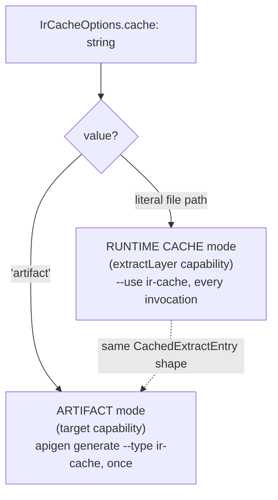
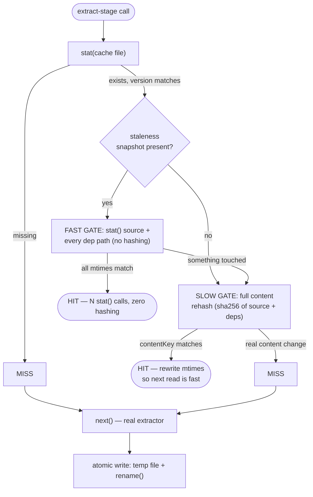

# @adhd/apigen-plugin-ir-cache

Extract-stage IR cache plugin (FEAT-002, Revision 2): caches the derived IR
(`Operation[]`) of one `ExtractCall` so repeat extraction of unchanged source
is answered from disk instead of re-running the extractor (~3.4s of the
backlog CLI's cold-start cost, BUG-019).

One `IrCacheOptions.cache` option selects one of two modes over the **same**
`CachedExtractEntry` shape — a consumer can switch modes later with zero
format migration:



## RUNTIME CACHE mode (`cache: <file-path>`) — the `extractLayer` capability

A single, literal, pre-agreed file **is** the entire cache — not a
content-addressed directory of many keyed files. The caller already knows
exactly which file to open; the only question on a read is "is what's in it
still fresh," answered by a two-tier staleness check so a clean, repeated,
unchanged-source call costs a handful of `stat()` calls, not a full content
rehash:



1. **Missing file**, or a mismatched `formatVersion`/`extractorVersion` → MISS.
2. **Fast gate** — `stat()` the recorded source path and every recorded
   transitive-import dep path directly (no `collectLocalImportPaths` call, no
   hashing). All current `mtimeMs` match the recorded snapshot → **HIT**,
   `O(deps)` cheap `stat()` calls only.
3. **Slow gate** (a `staleness` snapshot exists but at least one mtime
   disagrees) — recompute the full content/version-addressed key
   (`computeCacheKey`: sha256 of the source and every transitive local
   import, plus `extractorVersion`/`formatVersion`). Match → HIT (a `touch`
   with no real edit, e.g. a fresh git checkout that didn't preserve mtimes)
   — the entry's `staleness` mtimes are then rewritten fire-and-forget so the
   NEXT read takes the fast path again. Mismatch → MISS.
4. **No `staleness` snapshot at all** (an ARTIFACT-mode-written entry, or a
   legacy pre-Revision-2 entry) — `formatVersion`/`extractorVersion` already
   gate correctness, so the entry is trusted as a HIT rather than MISSed on
   absent metadata; a `staleness` snapshot is opportunistically computed and
   backfilled fire-and-forget so the NEXT read gets the fast path.
5. **MISS** in any case → `next()` runs the real extractor; the result is
   written through **atomically** (temp file + `rename()`) and
   fire-and-forget — a slow or failing backend can never add latency to a
   MISS or fail the run.

```ts
import { createExtractInvoker } from '@adhd/apigen-core-client';
import { createIrCacheLayer } from '@adhd/apigen-plugin-ir-cache';

const extractInvoke = createExtractInvoker(
  [createIrCacheLayer({ cache: '/path/to/ir-cache.json', extractorVersion })],
  (call) => extract({ sourceFile: call.source, namespace: call.namespace })
);

const operations = await extractInvoke({
  source: '/path/to/client.d.ts',
  host: 'ts',
  namespace: 'backlog',
});
```

## ARTIFACT mode (`cache: 'artifact'`) — the `target` capability

A one-shot, build-time JSON artifact produced once, via
`apigen generate --type ir-cache --opt cache=artifact`, that ships alongside
a consumer's own build with **zero** extraction machinery in the runtime
path at all — not even a cache lookup. The emitted entry has no `staleness`
field: an artifact is never staleness-checked at read time; its freshness
comes from *when* the generating command was run.

Reuses the existing `target`/`generate` capability and CLI surface rather
than a build-hook (e.g. rollup `writeBundle`) specifically to avoid a
chicken-and-egg ordering hazard: rollup resolves static imports **before**
`writeBundle`-style hooks fire, so a chunk containing
`import data from './client.ir.json'` would be unresolvable the first time
generation happened inside the same build pass that imports it. Artifact
production must run as a **separate, prior** step — see
[the design doc's R2.4](../../../docs/apigen/design-notes/extract-stage-onion-and-ir-cache.md#r24--artifact-mode-cache-artifact--the-target-capability)
for the full ordering-constraint rationale and the recommended Nx
`generate-ir-cache` → `build` `dependsOn` wiring.

```ts
import { buildIrCacheArtifact } from '@adhd/apigen-plugin-ir-cache';
// invoked by the CLI's `--type ir-cache` target dispatch — see generate.ts
```

## Generic `--use`/`--type` composition

`src/index.ts` exports a single `irCachePlugin: Plugin<IrCacheOptions>`
carrying **both** capabilities — `extractLayer` (RUNTIME CACHE, `--use
ir-cache`) and `target` (ARTIFACT, `--type ir-cache --opt cache=artifact`).
Every apigen-cli command that extracts (`generate`/`run`/`generate-registry`/
`run-registry`) funnels through `orchestrator.ts`'s single `extractSource()`
call site, which wraps the real extractor with
`createExtractInvokerFromPlugins(usePluginObjects, runExtractor)` — so
`--use ir-cache` transparently wraps every command's extraction, not just a
hand-wired call site. `entrypoint/backlog/src/server.ts` loads the same
exported `irCachePlugin` object rather than hand-constructing a layer, and
gates its inclusion behind `APIGEN_IR_CACHE_ENABLED` (default `'1'`; `'0'`
omits the plugin entirely) — its three transports (HTTP/MCP/CLI) are a live
mount, not a `--use`-flag-parsed invocation, so an env var is that host's
only available opt-out surface.

**`--opt cache=<path>` is honored.** `irCachePlugin`'s `extractLayer`
capability declares `createLayer(opts)` (`ExtractLayerCapability.createLayer`,
`@adhd/apigen-core-client`'s `plugin.ts`) alongside its static `layer`
fallback: `createExtractInvokerFromPlugins` calls `createLayer(opts)` once
per plugin at invoker-construction time with this invocation's flat `--opt`
bag (the same bag already passed to `target.generate`'s `opts` — apigen-cli
has one flat bag per invocation, not a per-plugin-id namespaced one), and
prefers it over `layer` whenever present. So:

```sh
apigen run --source client.ts --type api-fastify --use ir-cache --opt cache=./tmp/ir-cache.json
```

actually caches at `./tmp/ir-cache.json` — not the `APIGEN_IR_CACHE_FILE`
env var or the `tmp/apigen/ir-cache/default.ir.json` default. `--opt
extractorVersion=<v>` is honored the same way. Only a bare `--use ir-cache`
with no `--opt cache=` falls back to the env-var/default middleware
(`layer`) — unchanged from before this fix, and still the right choice for a
caller with no per-invocation configuration need.

A host with no `--use`/`--opt` CLI surface at all (e.g.
`entrypoint/backlog/src/server.ts`'s live MCP/HTTP mount) still builds its
own `Plugin` object directly via the exported `createIrCacheLayer(opts)`
factory, exactly as before — `createLayer`/`opts` only matters for a
`--use`-flag-parsed invocation.

## Backends

- `createSingleFileBackend(path)` — the RUNTIME CACHE mode backend: one
  literal file is the entire cache, `get`/`put` ignore the `key` parameter
  entirely. Writes atomically (temp file + `rename()`).
- `createLocalFsBackend(dir)` — content-addressed directory
  (`<dir>/<key>.json`), one file per key. Kept for a possible future
  multi-key/shared backend (e.g. an Nx-remote-cache-style HTTP store keyed by
  content hash); not used by either of this plugin's two default modes today.
  Also writes atomically.
- **Shared/remote backend (not built):** `IrCacheBackend` (`get`/`put` by
  key) is the seam; an HTTP content-addressed store is a same-shape
  implementation swap. Note the inherited trust model — a shared cache
  accepts entries written by other machines/CI (the same model Nx's own
  remote cache accepts), so a shared backend should only be pointed at
  writers you trust.

## Cache-key guarantees and known gaps

- The full content/version-addressed key (`computeCacheKey`, used on the
  slow gate and by ARTIFACT-mode-compatible reads) covers: entry file
  content, all transitive local (non-`node_modules`) imports,
  `extractorVersion`, `formatVersion`, `host`, `namespace`.
- The fast gate trusts mtime as a *sufficient* condition for freshness
  (matching make/Nx/tsc's own incremental-build convention) — a genuinely
  reverted-but-touched file is caught by the slow gate's real rehash, which
  the fast gate falls back to on any mtime mismatch; a fast-gate false HIT
  is not possible without also passing the slow gate's content check, since
  the slow gate is what re-validates whenever an mtime disagrees.
- `extractorVersion` is what busts the cache when the extractor's output
  changes for the same input — including a future DEBT-003 fix (Path 2
  morph-walk correctness), which must bump it.
- `versionHint` on `ExtractCall` is deliberately ignored — a shared cache
  must never key on an unverified caller-supplied identity.
- **Known gap:** a dependency (`node_modules`) version bump that changes a
  named type's shape without touching any locally-tracked file is a false
  HIT. `extractorVersion` covers extractor-side changes only, not
  third-party dependency changes.
- **Known gap:** concurrent writers on a MISS (RUNTIME CACHE mode) are not
  coordinated — `rename()` makes each individual write atomic, but two
  processes racing the same MISS both compute and write independently; the
  last `rename()` wins. Accepted as "both computed the same answer, one
  redundant write is lost" — not independently verified for a
  non-deterministic extractor output (an open question, not a fix).
- **Known gap:** ARTIFACT mode's default `filename` (`ir-cache.json`)
  collides across multiple sources if a future multi-source
  `generate-registry`-driven artifact build runs the `ir-cache` target once
  per source into the same `--out-dir` — every source would silently
  overwrite the last. Not exercised by the single-source `generate` path
  this slice targets.
- The directory-shaped `createLocalFsBackend` retains its original
  known gap from v1: nothing evicts an orphaned entry for a
  no-longer-current content version. Not used by either default mode today,
  so this is dormant unless a future caller opts into it directly.

## Building / testing

```sh
npx nx build apigen-plugin-ir-cache
npx nx test apigen-plugin-ir-cache
npx nx lint apigen-plugin-ir-cache
```
